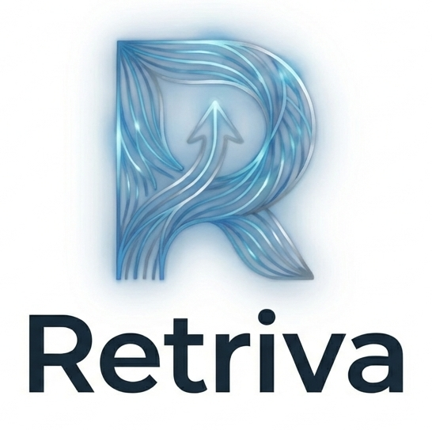
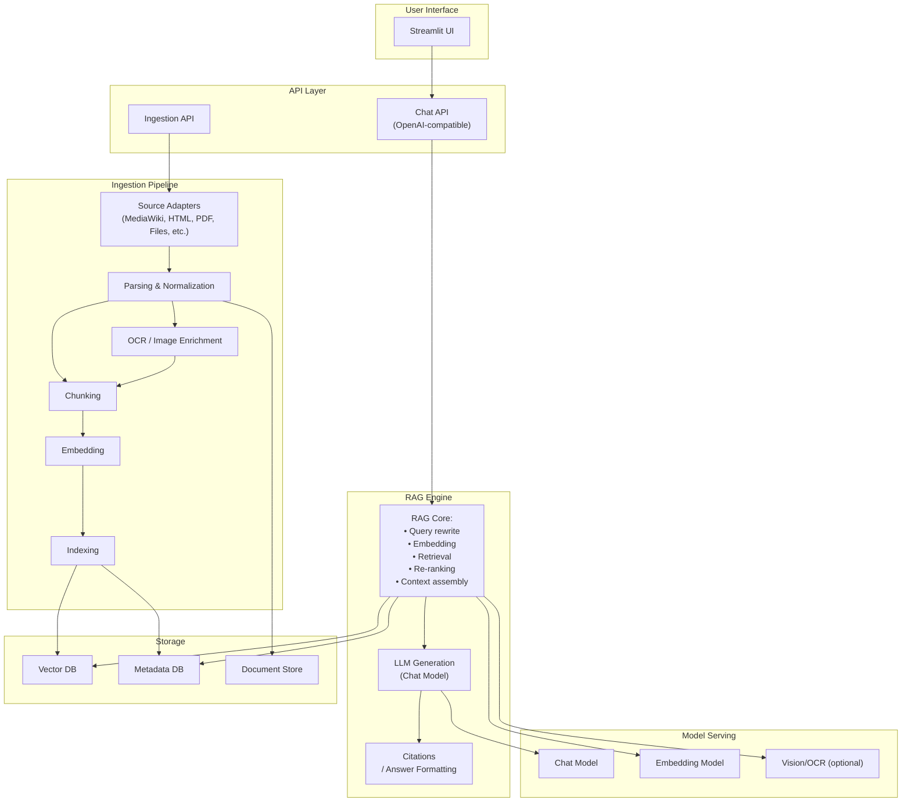
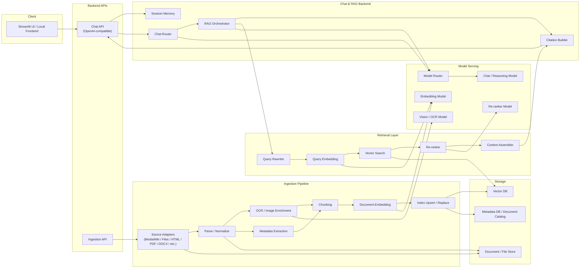
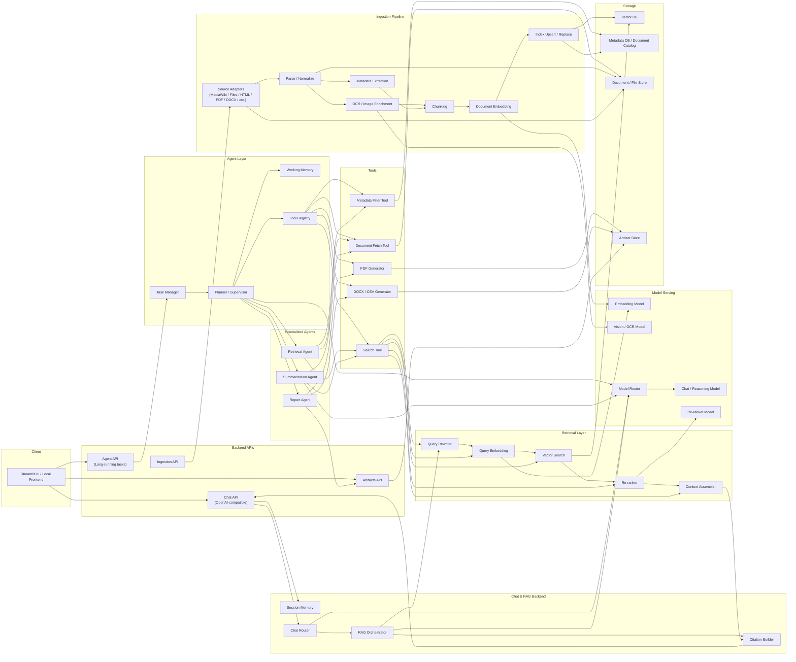
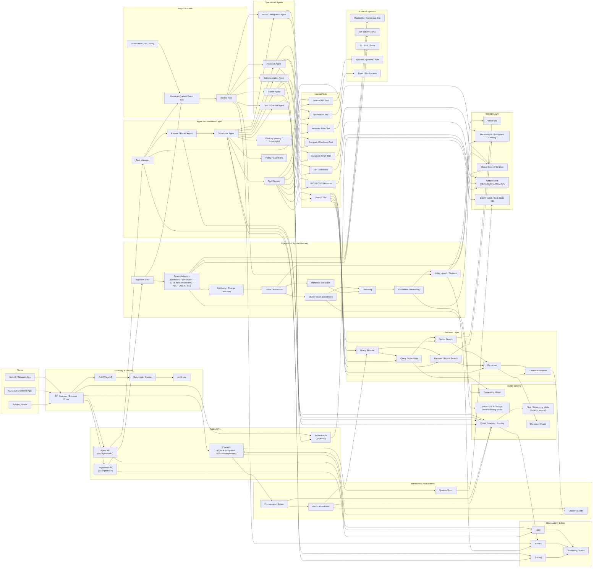
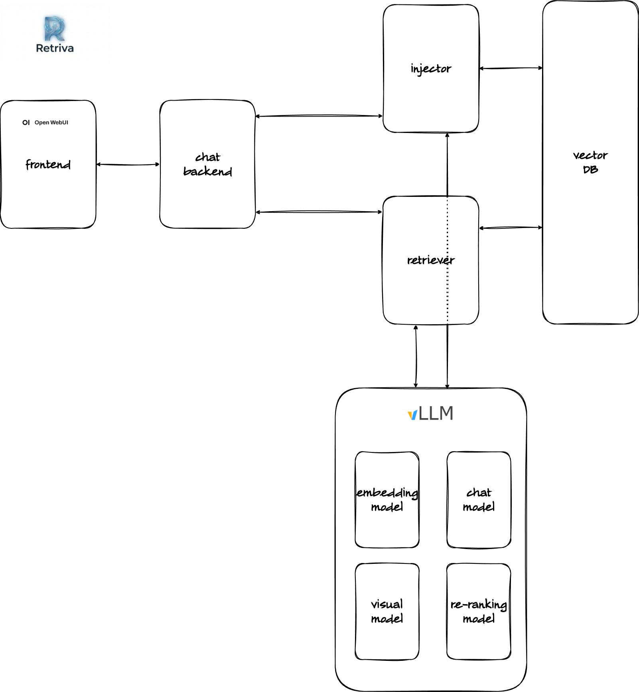

# Project Retriva's documentation

- [Project Retriva's documentation](#project-retrivas-documentation)
  - [Introduction](#introduction)
  - [Design](#design)
    - [AI-assisted design sessions](#ai-assisted-design-sessions)
  - [Preliminary roadmap](#preliminary-roadmap)
    - [Stage #1](#stage-1)
    - [Stage #2](#stage-2)
    - [Stage #3](#stage-3)
    - [Stage #4](#stage-4)
    - [Stage #5](#stage-5)
  - [Implementation](#implementation)
    - [Attempt #1 (v0.1)](#attempt-1-v01)
      - [Conclusion of the v0.1 implementation](#conclusion-of-the-v01-implementation)
    - [Subsequent developments](#subsequent-developments)

## Introduction

This project is an attempt to kill two birds with one stone:

1. To challenge myself with a non-trivial project that would allow me to put into practice what I have learned in the field of AI over the past few years through self-study and the courses I have attended. Indeed, if there is one thing I have no doubt about, it is that in disciplines such as electronic and computer engineering, it is essential to get one’s hands dirty in order to truly internalize concepts that have only been studied on paper.
2. To find a solution for querying, in natural language, the knowledge base (KB) built on the document archive of my company’s R&D department, developed over the decades and implemented as a website based on [MediaWiki](https://www.mediawiki.org/wiki/MediaWiki).

The need described in point 2 quickly led me toward developing a conversational agent equipped with RAG capabilities, which I named Retriva. Retriva is supposed to be a system perfectly aligned with the technologies referred to in point 1. In addition, throughout the project I have tried to use AI tools to help me tackle its various phases, as will be described in greater detail in the rest of the document.

In the section dedicated to the design, the system requirements and specifications are discussed in greater detail. For the time being, I will simply recall that, from the very beginning, the project was conceived to satisfy a strict confidentiality requirement: use of external services was ruled out in order to ensure that the information contained in the knowledge base would never leave the company’s perimeter. All things considered, the system could therefore — with the appropriate adaptations — be reused in many enterprise scenarios. The need to consult knowledge accumulated over time while offering a UX that keeps pace with the times is, in fact, very widespread among companies, regardless of the sector in which they operate.

Before launching the project, I had tried to meet my needs by adopting a “minimum effort, maximum result” approach. In practice, I attempted to solve the problem using tools such as [Cheshire Cat](https://cheshirecat.ai/) or [AnythingLLM](https://anythingllm.com/). While these tools are more or less ready to use, they obviously do not allow one to learn much and, above all, they offer only limited control over the underlying mechanisms, first and foremost the process of building the proprietary knowledge base. This therefore led me to decide to take the bull by the horns and try to create something truly satisfactory for my needs.

## Design

### AI-assisted design sessions

* [#1](./design_sessions/Retriva-design_1.pdf)

## Preliminary roadmap

Generally speaking, the project's development plan should includes the major phases desripted in the following paragraphs.

### Stage #1

In a development environment, implementation of a proof-of-concept (PoC) that uses a public Mediawiki site and whose goal is to validate the overall architecture.

### Stage #2

Creation of a usable but unoptimized first version.

### Stage #3

Gradual integration of more advanced technologies for improving retrieval.

### Stage #4

Moveing to the "real" knowledge base, i.e. the one generated from the confidential Mediawiki website and deploy Retriva in the business environment.

### Stage #5

Adding advanced functionality such as agent capabilities and user role management.

## Implementation

In recent times, terms like “vibe coding” and “spec-defined development” have spread just as quickly as the jaw-dropping advancements in AI technology. Often, however, this wave of collective euphoria leads to confusion about certain concepts and the mistaken belief that terms which actually refer to different things are synonymous.

In the context of the project Retriva, *vibe coding* must be intended as an AI-assisted software development practice where a user describes a project in natural language and relies on a Large Language Model (LLM) to generate the actual source code. Instead of writing or reviewing code line-by-line, the "vibe coder" focuses on high-level goals and iterative feedback—essentially "coding by vibes". Its core Concepts are:

* Prompt-Driven Development: The primary role of the developer shifts from writing syntax to guiding an AI assistant through conversational prompts.
* Outcome Focus: Users prioritize the final product over the implementation details, often "forgetting the code even exists".
* Iterative Refining: If the generated code has errors, the user copies the error message back to the AI and asks for a fix rather than manually debugging.

The term was coined by computer scientist Andrej Karpathy in February 2025. It gained rapid traction and was named the Collins English Dictionary Word of the Year for 2025.
Key benefits and risks of such an approach are listed in the following table.

| Feature         | Description                                                                                                      |
| ----------------- | ------------------------------------------------------------------------------------------------------------------ |
| Accessibility   | Enables non-programmers to build functional apps, like software for one                                          |
| Speed           | Massive productivity gains for prototyping and "throwaway" weekend projects                                      |
| Security Risk   | AI-generated code may contain vulnerabilities that the user cannot identify due to a lack of technical knowledge |
| Maintainability | Resulting codebases can be brittle, opaque, and difficult to update long-term                                    |

Instead, *spec-driven development* (SDD) is a structured engineering methodology to AI-assisted coding where a detailed, ofte machine-readable specification is authored and approved before any code is generated, serving as the "single source of truth." While vibe coding relies on a trial-and-error "conversation" with an AI, SDD treats a formal document as the single source of truth for the project. Key characteristics of SDD are:

* Specification as the Primary Artifact: Instead of focusing on the code itself, the developer focuses on maintaining a living "spec" file (often in Markdown). If the code needs to change, the developer updates the spec first, and the AI regenerates the code to match.
* Structured Workflow: Unlike the fluid nature of vibe coding, SDD follows a disciplined process:
  * Prompt for Behavior: Describe the goals and constraints.
  * Generate Requirements: The AI drafts a technical specification.
  * Review and Approve: The human developer edits and "locks" the spec.
  * Implementation: AI agents generate the code based on the approved spec.
  * Built-in Validation: Because the spec defines the rules (e.g., "the quantity must be a positive integer"), the AI can automatically generate and run tests to verify that its own code follows those rules.

The table below provides a brief comparison of the two approaches.

| Feature         | Vibe Coding                                                            | Spec-Driven Developmentcol           |
| ----------------- | ------------------------------------------------------------------------ | -------------------------------------- |
| Focus           | Speed and iteration                                                    | Intent and correctness               |
| Source of Truth | Ephemeral chat history                                                 | Persistent, version-controlled spec  |
| Best Use Case   | Prototypes and "software for one"	Enterprise systems and team projects | Enterprise systems and team projects |
| Developer Role  | Prompting and debugging                                                | Architecting and governing intent    |

I consider myself essentially approach-agnostic, in the sense that I do not belong to the camp of those who demonize or, conversely, glorify one approach over another. I think that, as usual in engineering, is a matter of trading off. Depending on the needs and available resources, one does one's best to balance the various—often conflicting—requirements.

I therefore don’t exclude that I might be trying different approaches during the implementation phase. For sure, I'll start excluding vibe coding as it conflict with my requirement #1.

### Attempt #1 (v0.1)

For this first attempt, I tool the opportunity to experiment with Google Atigravity. For  more technical details, see [here](./implementations/1/README.md).

#### Conclusion of the v0.1 implementation

Before starting the project, I had assumed that I would proceed very gradually and that I would need to experiment with various approaches and implementation philosophies before feeling confident that I was on the right track. That’s why I created the repository [retriva_impl_1_v0.1](https://github.com/am-dev-75/retriva_impl_1_v0.1): the name itself was meant to suggest that this would be the first of several attempts and that there would be quite a few experimental versions. I must say, however, that thanks to the power of the AI tools available today—which enable unprecedented effectiveness and efficiency—I feel confident in closing this preliminary experimental phase with version 0.1 and moving on to a new repository. This new repository, starting from the current codebase, should contain all future developments.

20260409 --AM

### Subsequent developments

