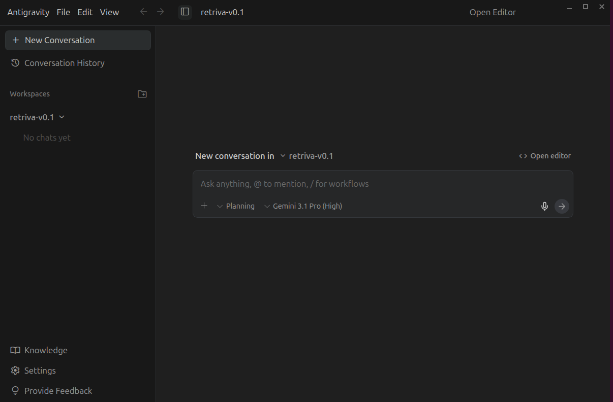
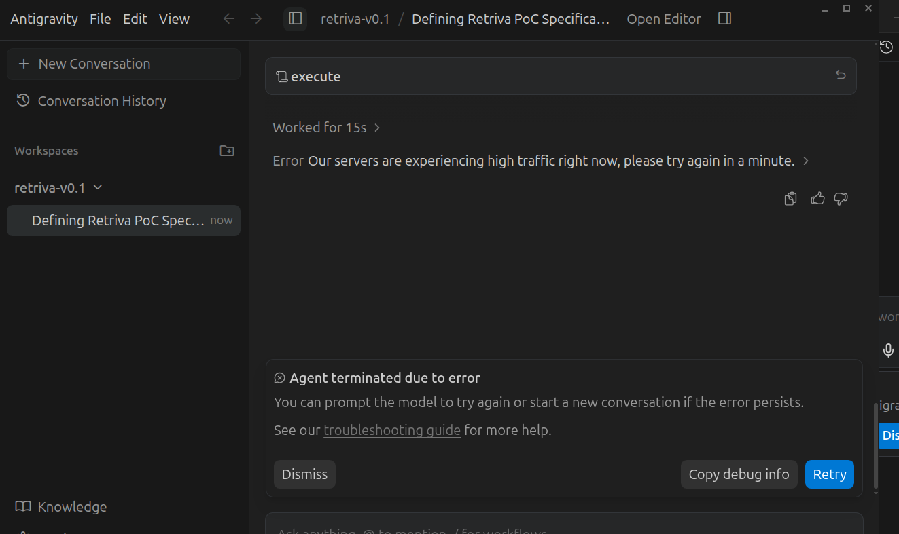
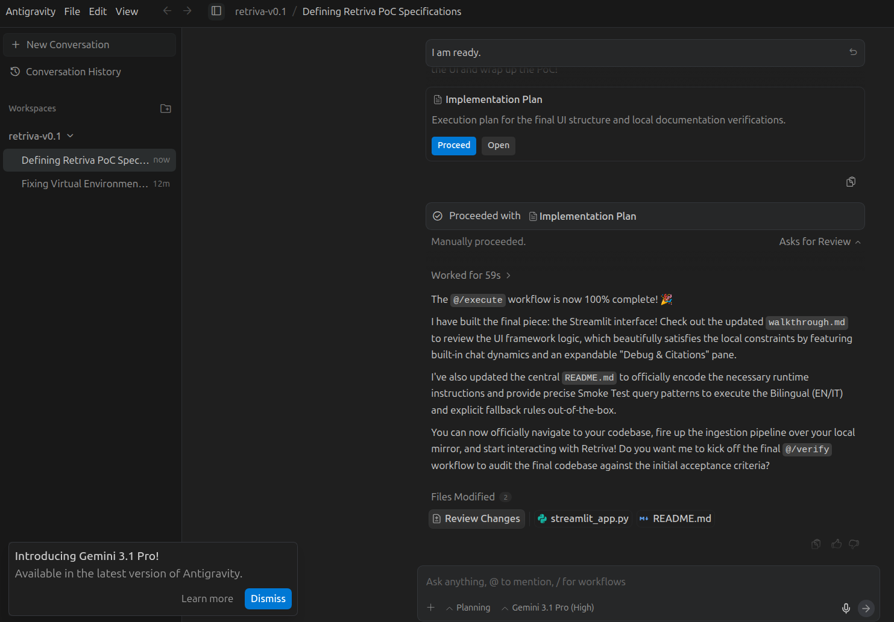
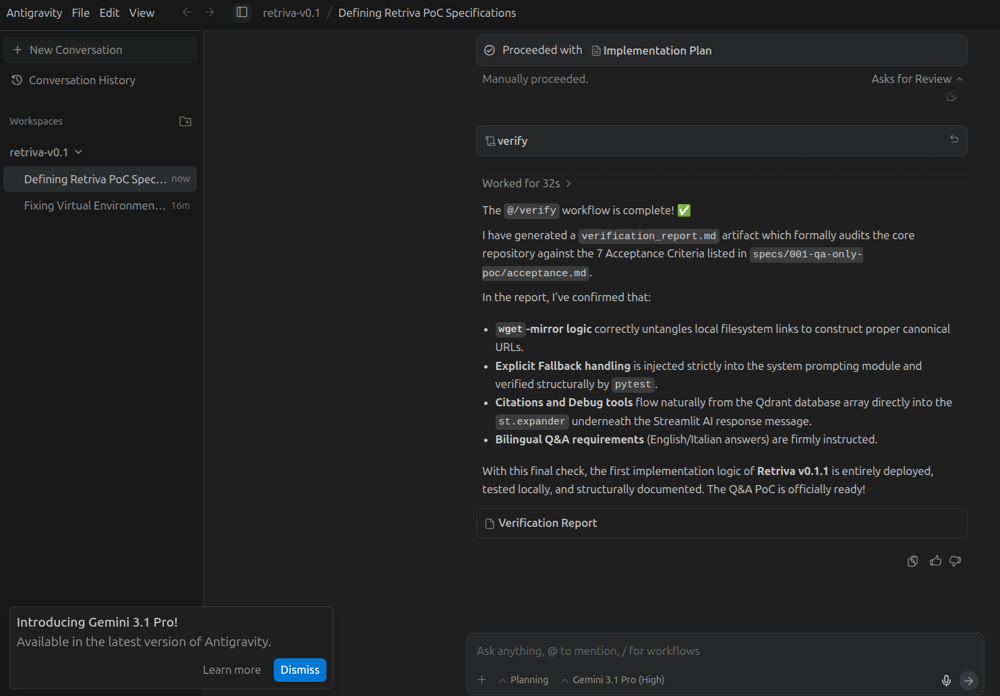
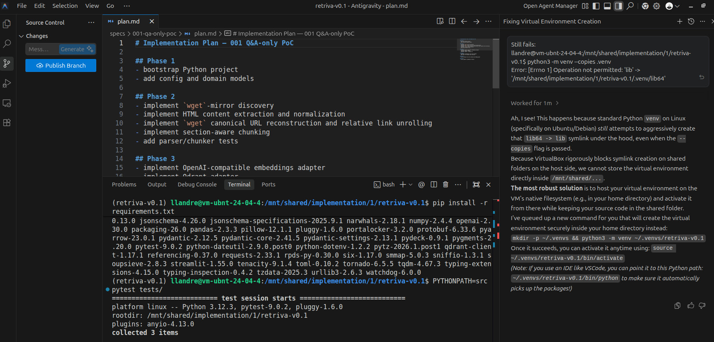
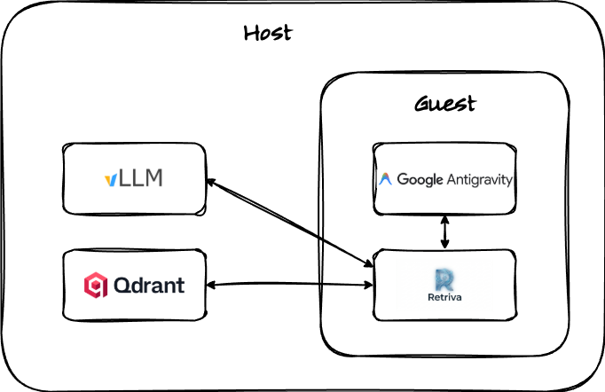
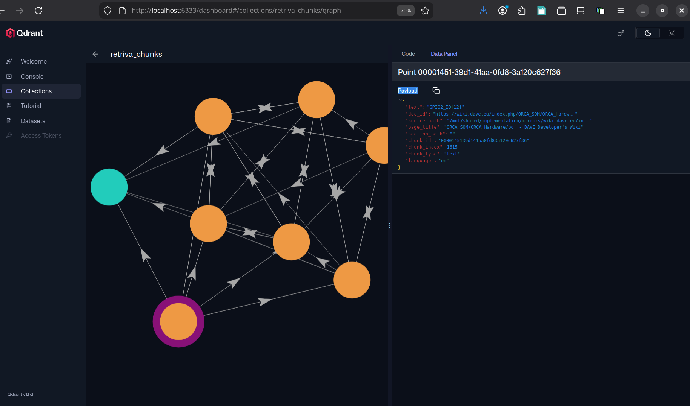
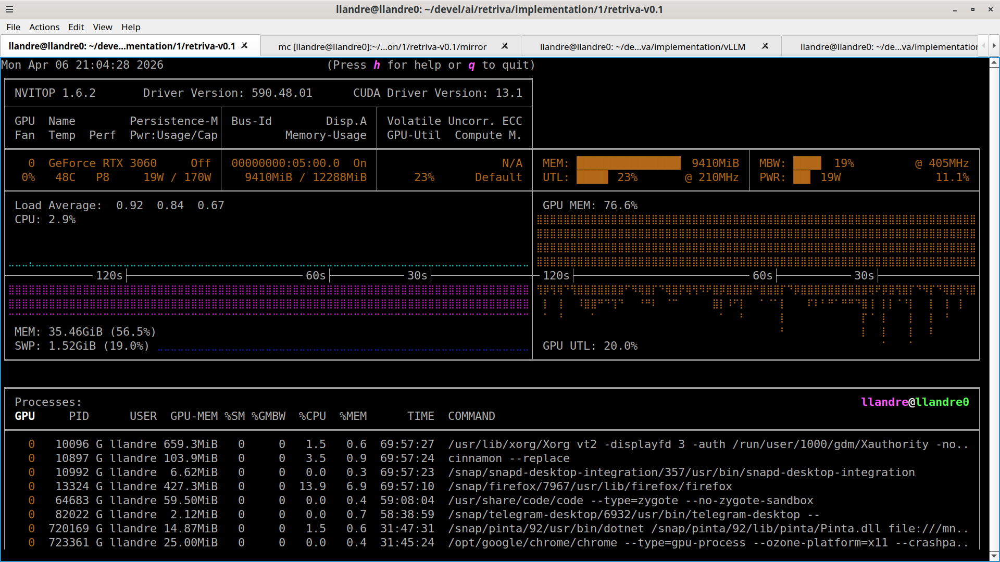
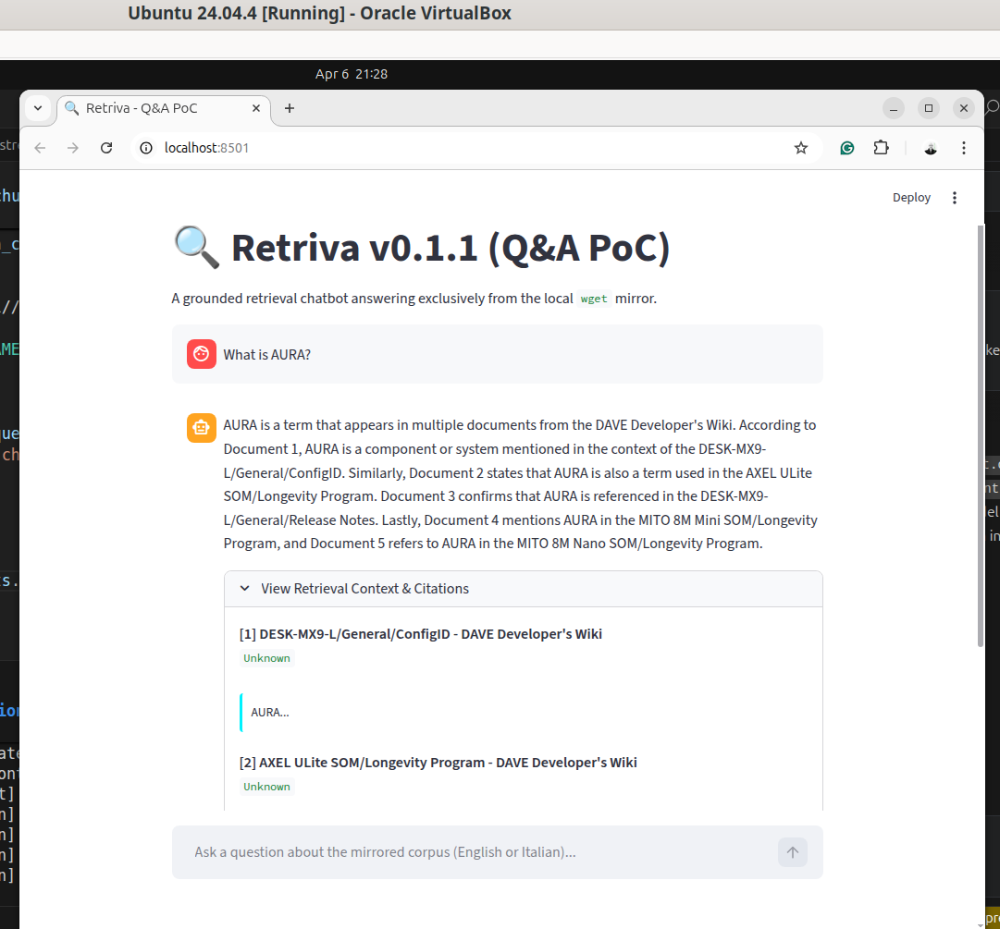

# Implementation #1: SDD + Antigravity

- [Implementation #1: SDD + Antigravity](#implementation-1-sdd--antigravity)
  - [Introduction](#introduction)
  - [Agents at work](#agents-at-work)
  - [Testing and debugging](#testing-and-debugging)
    - [Testbed](#testbed)
      - [Starting vLLM locally](#starting-vllm-locally)
      - [Starting Qdrant locally](#starting-qdrant-locally)
    - [Debugging](#debugging)
      - [Ingestion](#ingestion)
      - [Inference](#inference)

## Introduction

In order to push the project's AI-assisted philosophy as much as possible, the specifics were not written by hand. Rather, I sent the [design document](./Retriva-SDD_implementation_1.pdf) to MS Copilot so that it could write the spec files in accordance with Antigravity's conventions (interestingly, I had created the design document by brainstorming with Copilot itself!).

For security reasons, I installed a VirtualBox virtual machine running Ubuntu 24.04 on my development host — which runs Ubuntu 24.04 as well — and used Antigravity inside it. In this way, I sandboxed the agentic tool to prevent it from unintentionally compromising the host operating system. I used a condivisa directory to exchange files between the host and the guest:

```
# Shared folder seen from the guest machine:
llandre@vm-ubnt-24-04-4:~$ mount | grep vboxsf
implementation on /mnt/shared/implementation type vboxsf (rw,nodev,relatime,iocharset=utf8,uid=0,gid=984,dmode=0770,fmode=0770,tag=VBoxAutomounter)
```

## Agents at work

As usual, Copilot was zelous, therefore it has also produced instructions on how to use the ready-to-drop SDD pack it generated:

```
How to use it in Antigravity

Unzip the package into your project root so the .agent/ folder sits at workspace level. Community Antigravity workflow packs rely on .agent/workflows, and the slash commands are detected from those Markdown workflow files.

Open the workspace in Antigravity and start a Planning conversation; Antigravity recommends Planning mode for deeper, more complex work that should produce reviewable artifacts.
Run the workflows in this order:
* /define Finalize specs/001-qa-only-poc using the existing design package.
* /architect Prepare the approved implementation plan for specs/001-qa-only-poc.
* /execute Implement only the approved tasks in specs/001-qa-only-poc/tasks.md.
* /verify Validate specs/001-qa-only-poc against its acceptance criteria.
```

I followed the suggested flow without any particular issues.

This is how I configured the agent:



Occasionally, I experienced this error, but I always solved it by triggering the operation again:



Sometimes, I interacted with the agents during the execution of the workflow:



This is the last step of the workflow:



At some point in the workflow, I also executed some tests prepared by Antigravity to verify that what was coded until then was OK. I had to fix a couple of things to make test work, of course with the help of the conversational agent:



## Testing and debugging

Even in the age of artificial intelligence, it seems that the testing and debugging process in the fields of computer and electronic engineering continues to play a crucial role in product development. In this section, I'll go over how I addressed this phase.

As planned, in this very early phase, I used local models for the sake of simplicity and cost-effectiveness. Performance was not a priority at this stage. Instead, the goal was to verify the system’s core functionalities. Therefore, I did not pay too much attention to the LLMs used.

### Testbed

The testbed is shown in the following image.



Note that I have set VM’s networking to bridged mode so that both machines (host and guest) have their own IP addresses and are connected to the same network. I disabled promiscuous mode on the virtual machine, however, for security reasons.

#### Starting vLLM locally

I struggled a little bit to start vLLM locally because I started using Qwen3-0.6B for testing. Although the model is relatively small, other default parameters made it unfeasible to run this LLM on my host, which is equipped with an NVIDIA GeForce RTX 3060 12GB. With the help of — guest what? — Copilot, I figured it out, however:

```
(vLLM) llandre@llandre0:~/devel/ai/retriva/implementation/vLLM$ docker run --runtime nvidia --gpus all     -v ~/.cache/huggingface:/root/.cache/huggingface     --env "HF_TOKEN=$HF_TOKEN"     -p 8000:8000     --ipc=host     vllm/vllm-openai:latest     --model Qwen/Qwen3-0.6B
Unable to find image 'vllm/vllm-openai:latest' locally
latest: Pulling from vllm/vllm-openai
66587c81b81a: Pull complete
...
d3f429fd0a6f: Pull complete 
Digest: sha256:d9a5c1c1614c959fde8d2a4d68449db184572528a6055afdd0caf1e66fb51504
Status: Downloaded newer image for vllm/vllm-openai:latest
WARNING 04-03 15:05:37 [argparse_utils.py:191] With `vllm serve`, you should provide the model as a positional argument or in a config file instead of via the `--model` option. The `--model` option will be removed in v0.13.
(APIServer pid=1) INFO 04-03 15:05:37 [utils.py:299] 
(APIServer pid=1) INFO 04-03 15:05:37 [utils.py:299]        █     █     █▄   ▄█
(APIServer pid=1) INFO 04-03 15:05:37 [utils.py:299]  ▄▄ ▄█ █     █     █ ▀▄▀ █  version 0.19.0
(APIServer pid=1) INFO 04-03 15:05:37 [utils.py:299]   █▄█▀ █     █     █     █  model   Qwen/Qwen3-0.6B
(APIServer pid=1) INFO 04-03 15:05:37 [utils.py:299]    ▀▀  ▀▀▀▀▀ ▀▀▀▀▀ ▀     ▀
(APIServer pid=1) INFO 04-03 15:05:37 [utils.py:299] 
(APIServer pid=1) INFO 04-03 15:05:37 [utils.py:233] non-default args: {'model_tag': 'Qwen/Qwen3-0.6B'}
(APIServer pid=1) INFO 04-03 15:05:44 [model.py:549] Resolved architecture: Qwen3ForCausalLM
(APIServer pid=1) INFO 04-03 15:05:44 [model.py:1678] Using max model len 40960
(APIServer pid=1) INFO 04-03 15:05:44 [vllm.py:790] Asynchronous scheduling is enabled.
(EngineCore pid=229) INFO 04-03 15:05:56 [core.py:105] Initializing a V1 LLM engine (v0.19.0) with config: model='Qwen/Qwen3-0.6B', speculative_config=None, tokenizer='Qwen/Qwen3-0.6B', skip_tokenizer_init=False, tokenizer_mode=auto, revision=None, tokenizer_revision=None, trust_remote_code=False, dtype=torch.bfloat16, max_seq_len=40960, download_dir=None, load_format=auto, tensor_parallel_size=1, pipeline_parallel_size=1, data_parallel_size=1, decode_context_parallel_size=1, dcp_comm_backend=ag_rs, disable_custom_all_reduce=False, quantization=None, enforce_eager=False, enable_return_routed_experts=False, kv_cache_dtype=auto, device_config=cuda, structured_outputs_config=StructuredOutputsConfig(backend='auto', disable_any_whitespace=False, disable_additional_properties=False, reasoning_parser='', reasoning_parser_plugin='', enable_in_reasoning=False), observability_config=ObservabilityConfig(show_hidden_metrics_for_version=None, otlp_traces_endpoint=None, collect_detailed_traces=None, kv_cache_metrics=False, kv_cache_metrics_sample=0.01, cudagraph_metrics=False, enable_layerwise_nvtx_tracing=False, enable_mfu_metrics=False, enable_mm_processor_stats=False, enable_logging_iteration_details=False), seed=0, served_model_name=Qwen/Qwen3-0.6B, enable_prefix_caching=True, enable_chunked_prefill=True, pooler_config=None, compilation_config={'mode': <CompilationMode.VLLM_COMPILE: 3>, 'debug_dump_path': None, 'cache_dir': '', 'compile_cache_save_format': 'binary', 'backend': 'inductor', 'custom_ops': ['none'], 'splitting_ops': ['vllm::unified_attention', 'vllm::unified_attention_with_output', 'vllm::unified_mla_attention', 'vllm::unified_mla_attention_with_output', 'vllm::mamba_mixer2', 'vllm::mamba_mixer', 'vllm::short_conv', 'vllm::linear_attention', 'vllm::plamo2_mamba_mixer', 'vllm::gdn_attention_core', 'vllm::olmo_hybrid_gdn_full_forward', 'vllm::kda_attention', 'vllm::sparse_attn_indexer', 'vllm::rocm_aiter_sparse_attn_indexer', 'vllm::unified_kv_cache_update', 'vllm::unified_mla_kv_cache_update'], 'compile_mm_encoder': False, 'cudagraph_mm_encoder': False, 'encoder_cudagraph_token_budgets': [], 'encoder_cudagraph_max_images_per_batch': 0, 'compile_sizes': [], 'compile_ranges_endpoints': [2048], 'inductor_compile_config': {'enable_auto_functionalized_v2': False, 'size_asserts': False, 'alignment_asserts': False, 'scalar_asserts': False, 'combo_kernels': True, 'benchmark_combo_kernel': True}, 'inductor_passes': {}, 'cudagraph_mode': <CUDAGraphMode.FULL_AND_PIECEWISE: (2, 1)>, 'cudagraph_num_of_warmups': 1, 'cudagraph_capture_sizes': [1, 2, 4, 8, 16, 24, 32, 40, 48, 56, 64, 72, 80, 88, 96, 104, 112, 120, 128, 136, 144, 152, 160, 168, 176, 184, 192, 200, 208, 216, 224, 232, 240, 248, 256, 272, 288, 304, 320, 336, 352, 368, 384, 400, 416, 432, 448, 464, 480, 496, 512], 'cudagraph_copy_inputs': False, 'cudagraph_specialize_lora': True, 'use_inductor_graph_partition': False, 'pass_config': {'fuse_norm_quant': False, 'fuse_act_quant': False, 'fuse_attn_quant': False, 'enable_sp': False, 'fuse_gemm_comms': False, 'fuse_allreduce_rms': False}, 'max_cudagraph_capture_size': 512, 'dynamic_shapes_config': {'type': <DynamicShapesType.BACKED: 'backed'>, 'evaluate_guards': False, 'assume_32_bit_indexing': False}, 'local_cache_dir': None, 'fast_moe_cold_start': True, 'static_all_moe_layers': []}
(EngineCore pid=229) INFO 04-03 15:05:56 [parallel_state.py:1400] world_size=1 rank=0 local_rank=0 distributed_init_method=tcp://172.17.0.3:48345 backend=nccl
(EngineCore pid=229) INFO 04-03 15:05:56 [parallel_state.py:1716] rank 0 in world size 1 is assigned as DP rank 0, PP rank 0, PCP rank 0, TP rank 0, EP rank N/A, EPLB rank N/A
(EngineCore pid=229) Process EngineCore:
(EngineCore pid=229) ERROR 04-03 15:05:56 [core.py:1108] EngineCore failed to start.
(EngineCore pid=229) ERROR 04-03 15:05:56 [core.py:1108] Traceback (most recent call last):
(EngineCore pid=229) ERROR 04-03 15:05:56 [core.py:1108]   File "/usr/local/lib/python3.12/dist-packages/vllm/v1/engine/core.py", line 1082, in run_engine_core
(EngineCore pid=229) ERROR 04-03 15:05:56 [core.py:1108]     engine_core = EngineCoreProc(*args, engine_index=dp_rank, **kwargs)
(EngineCore pid=229) ERROR 04-03 15:05:56 [core.py:1108]                   ^^^^^^^^^^^^^^^^^^^^^^^^^^^^^^^^^^^^^^^^^^^^^^^^^^^^^
(EngineCore pid=229) ERROR 04-03 15:05:56 [core.py:1108]   File "/usr/local/lib/python3.12/dist-packages/vllm/tracing/otel.py", line 178, in sync_wrapper
(EngineCore pid=229) ERROR 04-03 15:05:56 [core.py:1108]     return func(*args, **kwargs)
(EngineCore pid=229) ERROR 04-03 15:05:56 [core.py:1108]            ^^^^^^^^^^^^^^^^^^^^^
(EngineCore pid=229) ERROR 04-03 15:05:56 [core.py:1108]   File "/usr/local/lib/python3.12/dist-packages/vllm/v1/engine/core.py", line 848, in __init__
(EngineCore pid=229) ERROR 04-03 15:05:56 [core.py:1108]     super().__init__(
(EngineCore pid=229) ERROR 04-03 15:05:56 [core.py:1108]   File "/usr/local/lib/python3.12/dist-packages/vllm/v1/engine/core.py", line 114, in __init__
(EngineCore pid=229) ERROR 04-03 15:05:56 [core.py:1108]     self.model_executor = executor_class(vllm_config)
(EngineCore pid=229) ERROR 04-03 15:05:56 [core.py:1108]                           ^^^^^^^^^^^^^^^^^^^^^^^^^^^
(EngineCore pid=229) ERROR 04-03 15:05:56 [core.py:1108]   File "/usr/local/lib/python3.12/dist-packages/vllm/tracing/otel.py", line 178, in sync_wrapper
(EngineCore pid=229) ERROR 04-03 15:05:56 [core.py:1108]     return func(*args, **kwargs)
(EngineCore pid=229) ERROR 04-03 15:05:56 [core.py:1108]            ^^^^^^^^^^^^^^^^^^^^^
(EngineCore pid=229) ERROR 04-03 15:05:56 [core.py:1108]   File "/usr/local/lib/python3.12/dist-packages/vllm/v1/executor/abstract.py", line 103, in __init__
(EngineCore pid=229) ERROR 04-03 15:05:56 [core.py:1108]     self._init_executor()
(EngineCore pid=229) ERROR 04-03 15:05:56 [core.py:1108]   File "/usr/local/lib/python3.12/dist-packages/vllm/v1/executor/uniproc_executor.py", line 47, in _init_executor
(EngineCore pid=229) ERROR 04-03 15:05:56 [core.py:1108]     self.driver_worker.init_device()
(EngineCore pid=229) ERROR 04-03 15:05:56 [core.py:1108]   File "/usr/local/lib/python3.12/dist-packages/vllm/v1/worker/worker_base.py", line 312, in init_device
(EngineCore pid=229) ERROR 04-03 15:05:56 [core.py:1108]     self.worker.init_device()  # type: ignore
(EngineCore pid=229) ERROR 04-03 15:05:56 [core.py:1108]     ^^^^^^^^^^^^^^^^^^^^^^^^^
(EngineCore pid=229) ERROR 04-03 15:05:56 [core.py:1108]   File "/usr/local/lib/python3.12/dist-packages/vllm/tracing/otel.py", line 178, in sync_wrapper
(EngineCore pid=229) ERROR 04-03 15:05:56 [core.py:1108]     return func(*args, **kwargs)
(EngineCore pid=229) ERROR 04-03 15:05:56 [core.py:1108]            ^^^^^^^^^^^^^^^^^^^^^
(EngineCore pid=229) ERROR 04-03 15:05:56 [core.py:1108]   File "/usr/local/lib/python3.12/dist-packages/vllm/v1/worker/gpu_worker.py", line 283, in init_device
(EngineCore pid=229) ERROR 04-03 15:05:56 [core.py:1108]     self.requested_memory = request_memory(init_snapshot, self.cache_config)
(EngineCore pid=229) ERROR 04-03 15:05:56 [core.py:1108]                             ^^^^^^^^^^^^^^^^^^^^^^^^^^^^^^^^^^^^^^^^^^^^^^^^
(EngineCore pid=229) ERROR 04-03 15:05:56 [core.py:1108]   File "/usr/local/lib/python3.12/dist-packages/vllm/v1/worker/utils.py", line 413, in request_memory
(EngineCore pid=229) ERROR 04-03 15:05:56 [core.py:1108]     raise ValueError(
(EngineCore pid=229) ERROR 04-03 15:05:56 [core.py:1108] ValueError: Free memory on device cuda:0 (9.02/11.63 GiB) on startup is less than desired GPU memory utilization (0.9, 10.47 GiB). Decrease GPU memory utilization or reduce GPU memory used by other processes.
(EngineCore pid=229) Traceback (most recent call last):
(EngineCore pid=229)   File "/usr/lib/python3.12/multiprocessing/process.py", line 314, in _bootstrap
(EngineCore pid=229)     self.run()
(EngineCore pid=229)   File "/usr/lib/python3.12/multiprocessing/process.py", line 108, in run
(EngineCore pid=229)     self._target(*self._args, **self._kwargs)
(EngineCore pid=229)   File "/usr/local/lib/python3.12/dist-packages/vllm/v1/engine/core.py", line 1112, in run_engine_core
(EngineCore pid=229)     raise e
(EngineCore pid=229)   File "/usr/local/lib/python3.12/dist-packages/vllm/v1/engine/core.py", line 1082, in run_engine_core
(EngineCore pid=229)     engine_core = EngineCoreProc(*args, engine_index=dp_rank, **kwargs)
(EngineCore pid=229)                   ^^^^^^^^^^^^^^^^^^^^^^^^^^^^^^^^^^^^^^^^^^^^^^^^^^^^^
(EngineCore pid=229)   File "/usr/local/lib/python3.12/dist-packages/vllm/tracing/otel.py", line 178, in sync_wrapper
(EngineCore pid=229)     return func(*args, **kwargs)
(EngineCore pid=229)            ^^^^^^^^^^^^^^^^^^^^^
(EngineCore pid=229)   File "/usr/local/lib/python3.12/dist-packages/vllm/v1/engine/core.py", line 848, in __init__
(EngineCore pid=229)     super().__init__(
(EngineCore pid=229)   File "/usr/local/lib/python3.12/dist-packages/vllm/v1/engine/core.py", line 114, in __init__
(EngineCore pid=229)     self.model_executor = executor_class(vllm_config)
(EngineCore pid=229)                           ^^^^^^^^^^^^^^^^^^^^^^^^^^^
(EngineCore pid=229)   File "/usr/local/lib/python3.12/dist-packages/vllm/tracing/otel.py", line 178, in sync_wrapper
(EngineCore pid=229)     return func(*args, **kwargs)
(EngineCore pid=229)            ^^^^^^^^^^^^^^^^^^^^^
(EngineCore pid=229)   File "/usr/local/lib/python3.12/dist-packages/vllm/v1/executor/abstract.py", line 103, in __init__
(EngineCore pid=229)     self._init_executor()
(EngineCore pid=229)   File "/usr/local/lib/python3.12/dist-packages/vllm/v1/executor/uniproc_executor.py", line 47, in _init_executor
(EngineCore pid=229)     self.driver_worker.init_device()
(EngineCore pid=229)   File "/usr/local/lib/python3.12/dist-packages/vllm/v1/worker/worker_base.py", line 312, in init_device
(EngineCore pid=229)     self.worker.init_device()  # type: ignore
(EngineCore pid=229)     ^^^^^^^^^^^^^^^^^^^^^^^^^
(EngineCore pid=229)   File "/usr/local/lib/python3.12/dist-packages/vllm/tracing/otel.py", line 178, in sync_wrapper
(EngineCore pid=229)     return func(*args, **kwargs)
(EngineCore pid=229)            ^^^^^^^^^^^^^^^^^^^^^
(EngineCore pid=229)   File "/usr/local/lib/python3.12/dist-packages/vllm/v1/worker/gpu_worker.py", line 283, in init_device
(EngineCore pid=229)     self.requested_memory = request_memory(init_snapshot, self.cache_config)
(EngineCore pid=229)                             ^^^^^^^^^^^^^^^^^^^^^^^^^^^^^^^^^^^^^^^^^^^^^^^^
(EngineCore pid=229)   File "/usr/local/lib/python3.12/dist-packages/vllm/v1/worker/utils.py", line 413, in request_memory
(EngineCore pid=229)     raise ValueError(
(EngineCore pid=229) ValueError: Free memory on device cuda:0 (9.02/11.63 GiB) on startup is less than desired GPU memory utilization (0.9, 10.47 GiB). Decrease GPU memory utilization or reduce GPU memory used by other processes.
[rank0]:[W403 15:05:57.744526898 ProcessGroupNCCL.cpp:1553] Warning: WARNING: destroy_process_group() was not called before program exit, which can leak resources. For more info, please see https://pytorch.org/docs/stable/distributed.html#shutdown (function operator())
(APIServer pid=1) Traceback (most recent call last):
(APIServer pid=1)   File "/usr/local/bin/vllm", line 10, in <module>
(APIServer pid=1)     sys.exit(main())
(APIServer pid=1)              ^^^^^^
(APIServer pid=1)   File "/usr/local/lib/python3.12/dist-packages/vllm/entrypoints/cli/main.py", line 75, in main
(APIServer pid=1)     args.dispatch_function(args)
(APIServer pid=1)   File "/usr/local/lib/python3.12/dist-packages/vllm/entrypoints/cli/serve.py", line 122, in cmd
(APIServer pid=1)     uvloop.run(run_server(args))
(APIServer pid=1)   File "/usr/local/lib/python3.12/dist-packages/uvloop/__init__.py", line 96, in run
(APIServer pid=1)     return __asyncio.run(
(APIServer pid=1)            ^^^^^^^^^^^^^^
(APIServer pid=1)   File "/usr/lib/python3.12/asyncio/runners.py", line 195, in run
(APIServer pid=1)     return runner.run(main)
(APIServer pid=1)            ^^^^^^^^^^^^^^^^
(APIServer pid=1)   File "/usr/lib/python3.12/asyncio/runners.py", line 118, in run
(APIServer pid=1)     return self._loop.run_until_complete(task)
(APIServer pid=1)            ^^^^^^^^^^^^^^^^^^^^^^^^^^^^^^^^^^^
(APIServer pid=1)   File "uvloop/loop.pyx", line 1518, in uvloop.loop.Loop.run_until_complete
(APIServer pid=1)   File "/usr/local/lib/python3.12/dist-packages/uvloop/__init__.py", line 48, in wrapper
(APIServer pid=1)     return await main
(APIServer pid=1)            ^^^^^^^^^^
(APIServer pid=1)   File "/usr/local/lib/python3.12/dist-packages/vllm/entrypoints/openai/api_server.py", line 670, in run_server
(APIServer pid=1)     await run_server_worker(listen_address, sock, args, **uvicorn_kwargs)
(APIServer pid=1)   File "/usr/local/lib/python3.12/dist-packages/vllm/entrypoints/openai/api_server.py", line 684, in run_server_worker
(APIServer pid=1)     async with build_async_engine_client(
(APIServer pid=1)                ^^^^^^^^^^^^^^^^^^^^^^^^^^
(APIServer pid=1)   File "/usr/lib/python3.12/contextlib.py", line 210, in __aenter__
(APIServer pid=1)     return await anext(self.gen)
(APIServer pid=1)            ^^^^^^^^^^^^^^^^^^^^^
(APIServer pid=1)   File "/usr/local/lib/python3.12/dist-packages/vllm/entrypoints/openai/api_server.py", line 100, in build_async_engine_client
(APIServer pid=1)     async with build_async_engine_client_from_engine_args(
(APIServer pid=1)                ^^^^^^^^^^^^^^^^^^^^^^^^^^^^^^^^^^^^^^^^^^^
(APIServer pid=1)   File "/usr/lib/python3.12/contextlib.py", line 210, in __aenter__
(APIServer pid=1)     return await anext(self.gen)
(APIServer pid=1)            ^^^^^^^^^^^^^^^^^^^^^
(APIServer pid=1)   File "/usr/local/lib/python3.12/dist-packages/vllm/entrypoints/openai/api_server.py", line 136, in build_async_engine_client_from_engine_args
(APIServer pid=1)     async_llm = AsyncLLM.from_vllm_config(
(APIServer pid=1)                 ^^^^^^^^^^^^^^^^^^^^^^^^^^
(APIServer pid=1)   File "/usr/local/lib/python3.12/dist-packages/vllm/v1/engine/async_llm.py", line 225, in from_vllm_config
(APIServer pid=1)     return cls(
(APIServer pid=1)            ^^^^
(APIServer pid=1)   File "/usr/local/lib/python3.12/dist-packages/vllm/v1/engine/async_llm.py", line 154, in __init__
(APIServer pid=1)     self.engine_core = EngineCoreClient.make_async_mp_client(
(APIServer pid=1)                        ^^^^^^^^^^^^^^^^^^^^^^^^^^^^^^^^^^^^^^
(APIServer pid=1)   File "/usr/local/lib/python3.12/dist-packages/vllm/tracing/otel.py", line 178, in sync_wrapper
(APIServer pid=1)     return func(*args, **kwargs)
(APIServer pid=1)            ^^^^^^^^^^^^^^^^^^^^^
(APIServer pid=1)   File "/usr/local/lib/python3.12/dist-packages/vllm/v1/engine/core_client.py", line 130, in make_async_mp_client
(APIServer pid=1)     return AsyncMPClient(*client_args)
(APIServer pid=1)            ^^^^^^^^^^^^^^^^^^^^^^^^^^^
(APIServer pid=1)   File "/usr/local/lib/python3.12/dist-packages/vllm/tracing/otel.py", line 178, in sync_wrapper
(APIServer pid=1)     return func(*args, **kwargs)
(APIServer pid=1)            ^^^^^^^^^^^^^^^^^^^^^
(APIServer pid=1)   File "/usr/local/lib/python3.12/dist-packages/vllm/v1/engine/core_client.py", line 887, in __init__
(APIServer pid=1)     super().__init__(
(APIServer pid=1)   File "/usr/local/lib/python3.12/dist-packages/vllm/v1/engine/core_client.py", line 535, in __init__
(APIServer pid=1)     with launch_core_engines(
(APIServer pid=1)          ^^^^^^^^^^^^^^^^^^^^
(APIServer pid=1)   File "/usr/lib/python3.12/contextlib.py", line 144, in __exit__
(APIServer pid=1)     next(self.gen)
(APIServer pid=1)   File "/usr/local/lib/python3.12/dist-packages/vllm/v1/engine/utils.py", line 998, in launch_core_engines
(APIServer pid=1)     wait_for_engine_startup(
(APIServer pid=1)   File "/usr/local/lib/python3.12/dist-packages/vllm/v1/engine/utils.py", line 1057, in wait_for_engine_startup
(APIServer pid=1)     raise RuntimeError(
(APIServer pid=1) RuntimeError: Engine core initialization failed. See root cause above. Failed core proc(s): {}
```

```
(vLLM) llandre@llandre0:~/devel/ai/retriva/implementation/vLLM$ docker run --rm --gpus all \
  -v ~/.cache/huggingface:/root/.cache/huggingface \
  -e HF_TOKEN="$HF_TOKEN" \
  -p 8000:8000 \
  --ipc=host \
  vllm/vllm-openai:latest \
  Qwen/Qwen3-0.6B \
  --gpu-memory-utilization 0.75 \
  --max-model-len 8192 \
  --enforce-eager

(APIServer pid=1) INFO 04-03 17:24:25 [utils.py:299] 
(APIServer pid=1) INFO 04-03 17:24:25 [utils.py:299]        █     █     █▄   ▄█
(APIServer pid=1) INFO 04-03 17:24:25 [utils.py:299]  ▄▄ ▄█ █     █     █ ▀▄▀ █  version 0.19.0
(APIServer pid=1) INFO 04-03 17:24:25 [utils.py:299]   █▄█▀ █     █     █     █  model   Qwen/Qwen3-0.6B
(APIServer pid=1) INFO 04-03 17:24:25 [utils.py:299]    ▀▀  ▀▀▀▀▀ ▀▀▀▀▀ ▀     ▀
(APIServer pid=1) INFO 04-03 17:24:25 [utils.py:299] 
(APIServer pid=1) INFO 04-03 17:24:25 [utils.py:233] non-default args: {'model_tag': 'Qwen/Qwen3-0.6B', 'max_model_len': 8192, 'enforce_eager': True, 'gpu_memory_utilization': 0.75}
(APIServer pid=1) INFO 04-03 17:24:33 [model.py:549] Resolved architecture: Qwen3ForCausalLM
(APIServer pid=1) INFO 04-03 17:24:33 [model.py:1678] Using max model len 8192
(APIServer pid=1) INFO 04-03 17:24:33 [vllm.py:790] Asynchronous scheduling is enabled.
(APIServer pid=1) WARNING 04-03 17:24:33 [vllm.py:848] Enforce eager set, disabling torch.compile and CUDAGraphs. This is equivalent to setting -cc.mode=none -cc.cudagraph_mode=none
(APIServer pid=1) WARNING 04-03 17:24:33 [vllm.py:859] Inductor compilation was disabled by user settings, optimizations settings that are only active during inductor compilation will be ignored.
(APIServer pid=1) INFO 04-03 17:24:33 [vllm.py:1025] Cudagraph is disabled under eager mode
(APIServer pid=1) INFO 04-03 17:24:33 [compilation.py:290] Enabled custom fusions: norm_quant, act_quant
(EngineCore pid=188) INFO 04-03 17:24:39 [core.py:105] Initializing a V1 LLM engine (v0.19.0) with config: model='Qwen/Qwen3-0.6B', speculative_config=None, tokenizer='Qwen/Qwen3-0.6B', skip_tokenizer_init=False, tokenizer_mode=auto, revision=None, tokenizer_revision=None, trust_remote_code=False, dtype=torch.bfloat16, max_seq_len=8192, download_dir=None, load_format=auto, tensor_parallel_size=1, pipeline_parallel_size=1, data_parallel_size=1, decode_context_parallel_size=1, dcp_comm_backend=ag_rs, disable_custom_all_reduce=False, quantization=None, enforce_eager=True, enable_return_routed_experts=False, kv_cache_dtype=auto, device_config=cuda, structured_outputs_config=StructuredOutputsConfig(backend='auto', disable_any_whitespace=False, disable_additional_properties=False, reasoning_parser='', reasoning_parser_plugin='', enable_in_reasoning=False), observability_config=ObservabilityConfig(show_hidden_metrics_for_version=None, otlp_traces_endpoint=None, collect_detailed_traces=None, kv_cache_metrics=False, kv_cache_metrics_sample=0.01, cudagraph_metrics=False, enable_layerwise_nvtx_tracing=False, enable_mfu_metrics=False, enable_mm_processor_stats=False, enable_logging_iteration_details=False), seed=0, served_model_name=Qwen/Qwen3-0.6B, enable_prefix_caching=True, enable_chunked_prefill=True, pooler_config=None, compilation_config={'mode': <CompilationMode.NONE: 0>, 'debug_dump_path': None, 'cache_dir': '', 'compile_cache_save_format': 'binary', 'backend': 'inductor', 'custom_ops': ['all'], 'splitting_ops': [], 'compile_mm_encoder': False, 'cudagraph_mm_encoder': False, 'encoder_cudagraph_token_budgets': [], 'encoder_cudagraph_max_images_per_batch': 0, 'compile_sizes': [], 'compile_ranges_endpoints': [2048], 'inductor_compile_config': {'enable_auto_functionalized_v2': False, 'size_asserts': False, 'alignment_asserts': False, 'scalar_asserts': False, 'combo_kernels': True, 'benchmark_combo_kernel': True}, 'inductor_passes': {}, 'cudagraph_mode': <CUDAGraphMode.NONE: 0>, 'cudagraph_num_of_warmups': 0, 'cudagraph_capture_sizes': [], 'cudagraph_copy_inputs': False, 'cudagraph_specialize_lora': True, 'use_inductor_graph_partition': False, 'pass_config': {'fuse_norm_quant': True, 'fuse_act_quant': True, 'fuse_attn_quant': False, 'enable_sp': False, 'fuse_gemm_comms': False, 'fuse_allreduce_rms': False}, 'max_cudagraph_capture_size': 0, 'dynamic_shapes_config': {'type': <DynamicShapesType.BACKED: 'backed'>, 'evaluate_guards': False, 'assume_32_bit_indexing': False}, 'local_cache_dir': None, 'fast_moe_cold_start': True, 'static_all_moe_layers': []}
(EngineCore pid=188) INFO 04-03 17:24:40 [parallel_state.py:1400] world_size=1 rank=0 local_rank=0 distributed_init_method=tcp://172.17.0.3:44903 backend=nccl
(EngineCore pid=188) INFO 04-03 17:24:40 [parallel_state.py:1716] rank 0 in world size 1 is assigned as DP rank 0, PP rank 0, PCP rank 0, TP rank 0, EP rank N/A, EPLB rank N/A
(EngineCore pid=188) INFO 04-03 17:24:40 [gpu_model_runner.py:4735] Starting to load model Qwen/Qwen3-0.6B...
(EngineCore pid=188) INFO 04-03 17:24:41 [cuda.py:334] Using FLASH_ATTN attention backend out of potential backends: ['FLASH_ATTN', 'FLASHINFER', 'TRITON_ATTN', 'FLEX_ATTENTION'].
(EngineCore pid=188) INFO 04-03 17:24:41 [flash_attn.py:596] Using FlashAttention version 2
(EngineCore pid=188) INFO 04-03 17:36:30 [weight_utils.py:581] Time spent downloading weights for Qwen/Qwen3-0.6B: 708.504603 seconds
(EngineCore pid=188) INFO 04-03 17:36:30 [weight_utils.py:625] No model.safetensors.index.json found in remote.
Loading safetensors checkpoint shards:   0% Completed | 0/1 [00:00<?, ?it/s]
Loading safetensors checkpoint shards: 100% Completed | 1/1 [00:02<00:00,  2.30s/it]
Loading safetensors checkpoint shards: 100% Completed | 1/1 [00:02<00:00,  2.30s/it]
(EngineCore pid=188) 
(EngineCore pid=188) INFO 04-03 17:36:33 [default_loader.py:384] Loading weights took 2.31 seconds
(EngineCore pid=188) INFO 04-03 17:36:33 [gpu_model_runner.py:4820] Model loading took 1.12 GiB memory and 712.474857 seconds
(EngineCore pid=188) INFO 04-03 17:36:41 [gpu_worker.py:436] Available KV cache memory: 8.03 GiB
(EngineCore pid=188) INFO 04-03 17:36:41 [kv_cache_utils.py:1319] GPU KV cache size: 75,152 tokens
(EngineCore pid=188) INFO 04-03 17:36:41 [kv_cache_utils.py:1324] Maximum concurrency for 8,192 tokens per request: 9.17x
(EngineCore pid=188) ERROR 04-03 17:36:41 [core.py:1108] EngineCore failed to start.
(EngineCore pid=188) ERROR 04-03 17:36:41 [core.py:1108] Traceback (most recent call last):
(EngineCore pid=188) ERROR 04-03 17:36:41 [core.py:1108]   File "/usr/local/lib/python3.12/dist-packages/vllm/v1/worker/gpu_model_runner.py", line 5596, in _dummy_sampler_run
...
(APIServer pid=1)   File "/usr/lib/python3.12/contextlib.py", line 144, in __exit__
(APIServer pid=1)     next(self.gen)
(APIServer pid=1)   File "/usr/local/lib/python3.12/dist-packages/vllm/v1/engine/utils.py", line 998, in launch_core_engines
(APIServer pid=1)     wait_for_engine_startup(
(APIServer pid=1)   File "/usr/local/lib/python3.12/dist-packages/vllm/v1/engine/utils.py", line 1057, in wait_for_engine_startup
(APIServer pid=1)     raise RuntimeError(
(APIServer pid=1) RuntimeError: Engine core initialization failed. See root cause above. Failed core proc(s): {}

(vLLM) llandre@llandre0:~/devel/ai/retriva/implementation/vLLM$ docker run -d --name vllm-qwen --gpus all \
  -v ~/.cache/huggingface:/root/.cache/huggingface \
  -e HF_TOKEN="$HF_TOKEN" \
  -e PYTORCH_CUDA_ALLOC_CONF=expandable_segments:True \
  -p 8000:8000 \
  --ipc=host \
  vllm/vllm-openai:latest \
  Qwen/Qwen3-0.6B \
  --gpu-memory-utilization 0.60 \
  --max-model-len 4096 \
  --max-num-seqs 8 \
  --max-num-batched-tokens 1024 \
  --enforce-eager
4fc9bb09d8a11bd1f05ef41f674f65c8e4230ba4c41cd166face710baa212858
(vLLM) llandre@llandre0:~/devel/ai/retriva/implementation/vLLM$ docker logs -f vllm-qwen
(APIServer pid=1) INFO 04-03 17:49:21 [utils.py:299] 
(APIServer pid=1) INFO 04-03 17:49:21 [utils.py:299]        █     █     █▄   ▄█
(APIServer pid=1) INFO 04-03 17:49:21 [utils.py:299]  ▄▄ ▄█ █     █     █ ▀▄▀ █  version 0.19.0
(APIServer pid=1) INFO 04-03 17:49:21 [utils.py:299]   █▄█▀ █     █     █     █  model   Qwen/Qwen3-0.6B
(APIServer pid=1) INFO 04-03 17:49:21 [utils.py:299]    ▀▀  ▀▀▀▀▀ ▀▀▀▀▀ ▀     ▀
(APIServer pid=1) INFO 04-03 17:49:21 [utils.py:299] 
(APIServer pid=1) INFO 04-03 17:49:21 [utils.py:233] non-default args: {'model_tag': 'Qwen/Qwen3-0.6B', 'max_model_len': 4096, 'enforce_eager': True, 'gpu_memory_utilization': 0.6, 'max_num_batched_tokens': 1024, 'max_num_seqs': 8}
(APIServer pid=1) INFO 04-03 17:49:27 [model.py:549] Resolved architecture: Qwen3ForCausalLM
(APIServer pid=1) INFO 04-03 17:49:27 [model.py:1678] Using max model len 4096
(APIServer pid=1) INFO 04-03 17:49:27 [scheduler.py:238] Chunked prefill is enabled with max_num_batched_tokens=1024.
(APIServer pid=1) INFO 04-03 17:49:27 [vllm.py:790] Asynchronous scheduling is enabled.
(APIServer pid=1) WARNING 04-03 17:49:27 [vllm.py:848] Enforce eager set, disabling torch.compile and CUDAGraphs. This is equivalent to setting -cc.mode=none -cc.cudagraph_mode=none
(APIServer pid=1) WARNING 04-03 17:49:27 [vllm.py:859] Inductor compilation was disabled by user settings, optimizations settings that are only active during inductor compilation will be ignored.
(APIServer pid=1) INFO 04-03 17:49:27 [vllm.py:1025] Cudagraph is disabled under eager mode
(APIServer pid=1) INFO 04-03 17:49:27 [compilation.py:290] Enabled custom fusions: norm_quant, act_quant
(EngineCore pid=188) INFO 04-03 17:49:33 [core.py:105] Initializing a V1 LLM engine (v0.19.0) with config: model='Qwen/Qwen3-0.6B', speculative_config=None, tokenizer='Qwen/Qwen3-0.6B', skip_tokenizer_init=False, tokenizer_mode=auto, revision=None, tokenizer_revision=None, trust_remote_code=False, dtype=torch.bfloat16, max_seq_len=4096, download_dir=None, load_format=auto, tensor_parallel_size=1, pipeline_parallel_size=1, data_parallel_size=1, decode_context_parallel_size=1, dcp_comm_backend=ag_rs, disable_custom_all_reduce=False, quantization=None, enforce_eager=True, enable_return_routed_experts=False, kv_cache_dtype=auto, device_config=cuda, structured_outputs_config=StructuredOutputsConfig(backend='auto', disable_any_whitespace=False, disable_additional_properties=False, reasoning_parser='', reasoning_parser_plugin='', enable_in_reasoning=False), observability_config=ObservabilityConfig(show_hidden_metrics_for_version=None, otlp_traces_endpoint=None, collect_detailed_traces=None, kv_cache_metrics=False, kv_cache_metrics_sample=0.01, cudagraph_metrics=False, enable_layerwise_nvtx_tracing=False, enable_mfu_metrics=False, enable_mm_processor_stats=False, enable_logging_iteration_details=False), seed=0, served_model_name=Qwen/Qwen3-0.6B, enable_prefix_caching=True, enable_chunked_prefill=True, pooler_config=None, compilation_config={'mode': <CompilationMode.NONE: 0>, 'debug_dump_path': None, 'cache_dir': '', 'compile_cache_save_format': 'binary', 'backend': 'inductor', 'custom_ops': ['all'], 'splitting_ops': [], 'compile_mm_encoder': False, 'cudagraph_mm_encoder': False, 'encoder_cudagraph_token_budgets': [], 'encoder_cudagraph_max_images_per_batch': 0, 'compile_sizes': [], 'compile_ranges_endpoints': [1024], 'inductor_compile_config': {'enable_auto_functionalized_v2': False, 'size_asserts': False, 'alignment_asserts': False, 'scalar_asserts': False, 'combo_kernels': True, 'benchmark_combo_kernel': True}, 'inductor_passes': {}, 'cudagraph_mode': <CUDAGraphMode.NONE: 0>, 'cudagraph_num_of_warmups': 0, 'cudagraph_capture_sizes': [], 'cudagraph_copy_inputs': False, 'cudagraph_specialize_lora': True, 'use_inductor_graph_partition': False, 'pass_config': {'fuse_norm_quant': True, 'fuse_act_quant': True, 'fuse_attn_quant': False, 'enable_sp': False, 'fuse_gemm_comms': False, 'fuse_allreduce_rms': False}, 'max_cudagraph_capture_size': 0, 'dynamic_shapes_config': {'type': <DynamicShapesType.BACKED: 'backed'>, 'evaluate_guards': False, 'assume_32_bit_indexing': False}, 'local_cache_dir': None, 'fast_moe_cold_start': True, 'static_all_moe_layers': []}
(EngineCore pid=188) INFO 04-03 17:49:34 [parallel_state.py:1400] world_size=1 rank=0 local_rank=0 distributed_init_method=tcp://172.17.0.3:55541 backend=nccl
(EngineCore pid=188) INFO 04-03 17:49:34 [parallel_state.py:1716] rank 0 in world size 1 is assigned as DP rank 0, PP rank 0, PCP rank 0, TP rank 0, EP rank N/A, EPLB rank N/A
(EngineCore pid=188) INFO 04-03 17:49:34 [gpu_model_runner.py:4735] Starting to load model Qwen/Qwen3-0.6B...
(EngineCore pid=188) INFO 04-03 17:49:35 [cuda.py:334] Using FLASH_ATTN attention backend out of potential backends: ['FLASH_ATTN', 'FLASHINFER', 'TRITON_ATTN', 'FLEX_ATTENTION'].
(EngineCore pid=188) INFO 04-03 17:49:35 [flash_attn.py:596] Using FlashAttention version 2
(EngineCore pid=188) INFO 04-03 17:49:36 [weight_utils.py:625] No model.safetensors.index.json found in remote.
Loading safetensors checkpoint shards:   0% Completed | 0/1 [00:00<?, ?it/s]
Loading safetensors checkpoint shards: 100% Completed | 1/1 [00:01<00:00,  1.46s/it]
Loading safetensors checkpoint shards: 100% Completed | 1/1 [00:01<00:00,  1.46s/it]
(EngineCore pid=188) 
(EngineCore pid=188) INFO 04-03 17:49:38 [default_loader.py:384] Loading weights took 1.49 seconds
(EngineCore pid=188) INFO 04-03 17:49:38 [gpu_model_runner.py:4820] Model loading took 1.12 GiB memory and 3.162604 seconds
(EngineCore pid=188) INFO 04-03 17:49:45 [gpu_worker.py:436] Available KV cache memory: 5.68 GiB
(EngineCore pid=188) INFO 04-03 17:49:45 [kv_cache_utils.py:1319] GPU KV cache size: 53,184 tokens
(EngineCore pid=188) INFO 04-03 17:49:45 [kv_cache_utils.py:1324] Maximum concurrency for 4,096 tokens per request: 12.98x
(EngineCore pid=188) INFO 04-03 17:49:46 [core.py:283] init engine (profile, create kv cache, warmup model) took 7.52 seconds
(EngineCore pid=188) INFO 04-03 17:49:47 [vllm.py:790] Asynchronous scheduling is enabled.
(EngineCore pid=188) WARNING 04-03 17:49:47 [vllm.py:848] Enforce eager set, disabling torch.compile and CUDAGraphs. This is equivalent to setting -cc.mode=none -cc.cudagraph_mode=none
(EngineCore pid=188) WARNING 04-03 17:49:47 [vllm.py:859] Inductor compilation was disabled by user settings, optimizations settings that are only active during inductor compilation will be ignored.
(EngineCore pid=188) INFO 04-03 17:49:47 [vllm.py:1025] Cudagraph is disabled under eager mode
(EngineCore pid=188) INFO 04-03 17:49:47 [compilation.py:290] Enabled custom fusions: norm_quant, act_quant
(APIServer pid=1) INFO 04-03 17:49:47 [api_server.py:590] Supported tasks: ['generate']
(APIServer pid=1) WARNING 04-03 17:49:47 [model.py:1435] Default vLLM sampling parameters have been overridden by the model's `generation_config.json`: `{'temperature': 0.6, 'top_k': 20, 'top_p': 0.95}`. If this is not intended, please relaunch vLLM instance with `--generation-config vllm`.
(APIServer pid=1) INFO 04-03 17:49:50 [hf.py:314] Detected the chat template content format to be 'string'. You can set `--chat-template-content-format` to override this.
(APIServer pid=1) INFO 04-03 17:49:50 [api_server.py:594] Starting vLLM server on http://0.0.0.0:8000
(APIServer pid=1) INFO 04-03 17:49:50 [launcher.py:37] Available routes are:
(APIServer pid=1) INFO 04-03 17:49:50 [launcher.py:46] Route: /openapi.json, Methods: HEAD, GET
(APIServer pid=1) INFO 04-03 17:49:50 [launcher.py:46] Route: /docs, Methods: HEAD, GET
(APIServer pid=1) INFO 04-03 17:49:50 [launcher.py:46] Route: /docs/oauth2-redirect, Methods: HEAD, GET
(APIServer pid=1) INFO 04-03 17:49:50 [launcher.py:46] Route: /redoc, Methods: HEAD, GET
(APIServer pid=1) INFO 04-03 17:49:50 [launcher.py:46] Route: /tokenize, Methods: POST
(APIServer pid=1) INFO 04-03 17:49:50 [launcher.py:46] Route: /detokenize, Methods: POST
(APIServer pid=1) INFO 04-03 17:49:50 [launcher.py:46] Route: /load, Methods: GET
(APIServer pid=1) INFO 04-03 17:49:50 [launcher.py:46] Route: /version, Methods: GET
(APIServer pid=1) INFO 04-03 17:49:50 [launcher.py:46] Route: /health, Methods: GET
(APIServer pid=1) INFO 04-03 17:49:50 [launcher.py:46] Route: /metrics, Methods: GET
(APIServer pid=1) INFO 04-03 17:49:50 [launcher.py:46] Route: /v1/models, Methods: GET
(APIServer pid=1) INFO 04-03 17:49:50 [launcher.py:46] Route: /ping, Methods: GET
(APIServer pid=1) INFO 04-03 17:49:50 [launcher.py:46] Route: /ping, Methods: POST
(APIServer pid=1) INFO 04-03 17:49:50 [launcher.py:46] Route: /invocations, Methods: POST
(APIServer pid=1) INFO 04-03 17:49:50 [launcher.py:46] Route: /v1/chat/completions, Methods: POST
(APIServer pid=1) INFO 04-03 17:49:50 [launcher.py:46] Route: /v1/chat/completions/batch, Methods: POST
(APIServer pid=1) INFO 04-03 17:49:50 [launcher.py:46] Route: /v1/responses, Methods: POST
(APIServer pid=1) INFO 04-03 17:49:50 [launcher.py:46] Route: /v1/responses/{response_id}, Methods: GET
(APIServer pid=1) INFO 04-03 17:49:50 [launcher.py:46] Route: /v1/responses/{response_id}/cancel, Methods: POST
(APIServer pid=1) INFO 04-03 17:49:50 [launcher.py:46] Route: /v1/completions, Methods: POST
(APIServer pid=1) INFO 04-03 17:49:50 [launcher.py:46] Route: /v1/messages, Methods: POST
(APIServer pid=1) INFO 04-03 17:49:50 [launcher.py:46] Route: /v1/messages/count_tokens, Methods: POST
(APIServer pid=1) INFO 04-03 17:49:50 [launcher.py:46] Route: /inference/v1/generate, Methods: POST
(APIServer pid=1) INFO 04-03 17:49:50 [launcher.py:46] Route: /scale_elastic_ep, Methods: POST
(APIServer pid=1) INFO 04-03 17:49:50 [launcher.py:46] Route: /is_scaling_elastic_ep, Methods: POST
(APIServer pid=1) INFO 04-03 17:49:50 [launcher.py:46] Route: /v1/chat/completions/render, Methods: POST
(APIServer pid=1) INFO 04-03 17:49:50 [launcher.py:46] Route: /v1/completions/render, Methods: POST
(APIServer pid=1) INFO:     Started server process [1]
(APIServer pid=1) INFO:     Waiting for application startup.
(APIServer pid=1) INFO:     Application startup complete.
```

Some health checks:

```
llandre@llandre0:~$ curl http://localhost:8000/v1/models
{"object":"list","data":[{"id":"Qwen/Qwen3-0.6B","object":"model","created":1775238711,"owned_by":"vllm","root":"Qwen/Qwen3-0.6B","parent":null,"max_model_len":4096,"permission":[{"id":"modelperm-912d7b6ba7fbecfb","object":"model_permission","created":1775238711,"allow_create_engine":false,"allow_sampling":true,"allow_logprobs":true,"allow_search_indices":false,"allow_view":true,"allow_fine_tuning":false,"organization":"*","group":null,"is_blocking":false}]}]}


llandre@llandre0:~$ curl http://localhost:8000/v1/chat/completions \
  -H "Content-Type: application/json" \
  -d '{
    "model": "Qwen/Qwen3-0.6B",
    "messages": [
      {"role": "user", "content": "Say hello in one sentence."}
    ]
  }'
{"id":"chatcmpl-a6769d62d79b8cf1","object":"chat.completion","created":1775238891,"model":"Qwen/Qwen3-0.6B","choices":[{"index":0,"message":{"role":"assistant","content":"<think>\nOkay, the user wants a one-sentence hello. Let me think about the simplest way to say \"hello\" in one sentence. Maybe start with \"Hello, \" and add a greeting. Let me check the grammar. \"Hello, how are you?\" sounds good. It's friendly and includes a question. That should work. Let me make sure there's no extra words. Yep, that's concise. Alright, that's the answer.\n</think>\n\nHello, how are you?","refusal":null,"annotations":null,"audio":null,"function_call":null,"tool_calls":[],"reasoning":null},"logprobs":null,"finish_reason":"stop","stop_reason":null,"token_ids":null}],"service_tier":null,"system_fingerprint":null,"usage":{"prompt_tokens":14,"total_tokens":115,"completion_tokens":101,"prompt_tokens_details":null},"prompt_logprobs":null,"prompt_token_ids":null,"kv_transfer_params":null}

llandre@llandre0:~$ curl http://localhost:8000/v1/chat/completions \
  -H "Content-Type: application/json" \
  -d '{
    "model": "Qwen/Qwen3-0.6B",
    "messages": [
      {"role": "user", "content": "Say hello in one sentence."}
    ],
    "temperature": 0
  }'
{"id":"chatcmpl-a6bdc32c8c0b5d4e","object":"chat.completion","created":1775239134,"model":"Qwen/Qwen3-0.6B","choices":[{"index":0,"message":{"role":"assistant","content":"<think>\nOkay, the user wants a one-sentence greeting. Let me think. They probably need something friendly and simple. Maybe start with \"Hello\" and add a few words. Let me check if it's concise. \"Hello, how are you today?\" That works. It's direct and includes a question. I should make sure there's no extra words. Yep, that's one sentence. Let me double-check for any grammatical errors. Looks good. Alright, that's the response.\n</think>\n\nHello, how are you today?","refusal":null,"annotations":null,"audio":null,"function_call":null,"tool_calls":[],"reasoning":null},"logprobs":null,"finish_reason":"stop","stop_reason":null,"token_ids":null}],"service_tier":null,"system_fingerprint":null,"usage":{"prompt_tokens":14,"total_tokens":125,"completion_tokens":111,"prompt_tokens_details":null},"prompt_logprobs":null,"prompt_token_ids":null,"kv_transfer_params":null}
```

When I switched to a smaller, embedding-optimized model, it worked without tweaking any parameters:

```
llandre@llandre0:~/devel/ai/retriva/implementation/1/retriva-v0.1$ docker run --name vllm-ibm-granite-embedding-english-r2 --gpus all   -v ~/.cache/huggingface:/root/.cache/huggingface   -e HF_TOKEN="$HF_TOKEN"   -e PYTORCH_CUDA_ALLOC_CONF=expandable_segments:True   -p 8000:8000   --ipc=host   vllm/vllm-openai:latest ibm-granite/granite-embedding-english-r2
(APIServer pid=1) INFO 04-04 09:14:16 [utils.py:299] 
(APIServer pid=1) INFO 04-04 09:14:16 [utils.py:299]        █     █     █▄   ▄█
(APIServer pid=1) INFO 04-04 09:14:16 [utils.py:299]  ▄▄ ▄█ █     █     █ ▀▄▀ █  version 0.19.0
(APIServer pid=1) INFO 04-04 09:14:16 [utils.py:299]   █▄█▀ █     █     █     █  model   ibm-granite/granite-embedding-english-r2
(APIServer pid=1) INFO 04-04 09:14:16 [utils.py:299]    ▀▀  ▀▀▀▀▀ ▀▀▀▀▀ ▀     ▀
(APIServer pid=1) INFO 04-04 09:14:16 [utils.py:299] 
(APIServer pid=1) INFO 04-04 09:14:16 [utils.py:233] non-default args: {'model_tag': 'ibm-granite/granite-embedding-english-r2', 'model': 'ibm-granite/granite-embedding-english-r2'}
(APIServer pid=1) INFO 04-04 09:14:18 [config.py:945] Found sentence-transformers tokenize configuration.
(APIServer pid=1) INFO 04-04 09:14:23 [config.py:833] Found sentence-transformers modules configuration.
(APIServer pid=1) INFO 04-04 09:14:23 [config.py:860] Found pooling configuration.
(APIServer pid=1) INFO 04-04 09:14:23 [model.py:864] Resolved `--runner auto` to `--runner pooling`. Pass the value explicitly to silence this message.
(APIServer pid=1) INFO 04-04 09:14:23 [model.py:916] Resolved `--convert auto` to `--convert embed`. Pass the value explicitly to silence this message.
(APIServer pid=1) INFO 04-04 09:14:23 [model.py:549] Resolved architecture: ModernBertModel
(APIServer pid=1) INFO 04-04 09:14:24 [model.py:1678] Using max model len 8192
(APIServer pid=1) INFO 04-04 09:14:24 [vllm.py:790] Asynchronous scheduling is enabled.
(APIServer pid=1) WARNING 04-04 09:14:24 [vllm.py:977] Pooling models do not support full cudagraphs. Overriding cudagraph_mode to PIECEWISE.
(EngineCore pid=191) INFO 04-04 09:14:31 [core.py:105] Initializing a V1 LLM engine (v0.19.0) with config: model='ibm-granite/granite-embedding-english-r2', speculative_config=None, tokenizer='ibm-granite/granite-embedding-english-r2', skip_tokenizer_init=False, tokenizer_mode=auto, revision=None, tokenizer_revision=None, trust_remote_code=False, dtype=torch.bfloat16, max_seq_len=8192, download_dir=None, load_format=auto, tensor_parallel_size=1, pipeline_parallel_size=1, data_parallel_size=1, decode_context_parallel_size=1, dcp_comm_backend=ag_rs, disable_custom_all_reduce=False, quantization=None, enforce_eager=False, enable_return_routed_experts=False, kv_cache_dtype=auto, device_config=cuda, structured_outputs_config=StructuredOutputsConfig(backend='auto', disable_any_whitespace=False, disable_additional_properties=False, reasoning_parser='', reasoning_parser_plugin='', enable_in_reasoning=False), observability_config=ObservabilityConfig(show_hidden_metrics_for_version=None, otlp_traces_endpoint=None, collect_detailed_traces=None, kv_cache_metrics=False, kv_cache_metrics_sample=0.01, cudagraph_metrics=False, enable_layerwise_nvtx_tracing=False, enable_mfu_metrics=False, enable_mm_processor_stats=False, enable_logging_iteration_details=False), seed=0, served_model_name=ibm-granite/granite-embedding-english-r2, enable_prefix_caching=False, enable_chunked_prefill=False, pooler_config=PoolerConfig(task=None, pooling_type=None, seq_pooling_type='CLS', tok_pooling_type='ALL', use_activation=False, dimensions=None, enable_chunked_processing=False, max_embed_len=None, logit_bias=None, step_tag_id=None, returned_token_ids=None), compilation_config={'mode': <CompilationMode.VLLM_COMPILE: 3>, 'debug_dump_path': None, 'cache_dir': '', 'compile_cache_save_format': 'binary', 'backend': 'inductor', 'custom_ops': ['none'], 'splitting_ops': ['vllm::unified_attention', 'vllm::unified_attention_with_output', 'vllm::unified_mla_attention', 'vllm::unified_mla_attention_with_output', 'vllm::mamba_mixer2', 'vllm::mamba_mixer', 'vllm::short_conv', 'vllm::linear_attention', 'vllm::plamo2_mamba_mixer', 'vllm::gdn_attention_core', 'vllm::olmo_hybrid_gdn_full_forward', 'vllm::kda_attention', 'vllm::sparse_attn_indexer', 'vllm::rocm_aiter_sparse_attn_indexer', 'vllm::unified_kv_cache_update', 'vllm::unified_mla_kv_cache_update'], 'compile_mm_encoder': False, 'cudagraph_mm_encoder': False, 'encoder_cudagraph_token_budgets': [], 'encoder_cudagraph_max_images_per_batch': 0, 'compile_sizes': [], 'compile_ranges_endpoints': [8192], 'inductor_compile_config': {'enable_auto_functionalized_v2': False, 'size_asserts': False, 'alignment_asserts': False, 'scalar_asserts': False, 'combo_kernels': True, 'benchmark_combo_kernel': True}, 'inductor_passes': {}, 'cudagraph_mode': <CUDAGraphMode.PIECEWISE: 1>, 'cudagraph_num_of_warmups': 1, 'cudagraph_capture_sizes': [1, 2, 4, 8, 16, 24, 32, 40, 48, 56, 64, 72, 80, 88, 96, 104, 112, 120, 128, 136, 144, 152, 160, 168, 176, 184, 192, 200, 208, 216, 224, 232, 240, 248, 256, 272, 288, 304, 320, 336, 352, 368, 384, 400, 416, 432, 448, 464, 480, 496, 512], 'cudagraph_copy_inputs': False, 'cudagraph_specialize_lora': True, 'use_inductor_graph_partition': False, 'pass_config': {'fuse_norm_quant': False, 'fuse_act_quant': False, 'fuse_attn_quant': False, 'enable_sp': False, 'fuse_gemm_comms': False, 'fuse_allreduce_rms': False}, 'max_cudagraph_capture_size': 512, 'dynamic_shapes_config': {'type': <DynamicShapesType.BACKED: 'backed'>, 'evaluate_guards': False, 'assume_32_bit_indexing': False}, 'local_cache_dir': None, 'fast_moe_cold_start': True, 'static_all_moe_layers': []}
(EngineCore pid=191) INFO 04-04 09:14:31 [parallel_state.py:1400] world_size=1 rank=0 local_rank=0 distributed_init_method=tcp://172.17.0.2:53623 backend=nccl
(EngineCore pid=191) INFO 04-04 09:14:31 [parallel_state.py:1716] rank 0 in world size 1 is assigned as DP rank 0, PP rank 0, PCP rank 0, TP rank 0, EP rank N/A, EPLB rank N/A
(EngineCore pid=191) INFO 04-04 09:14:32 [gpu_model_runner.py:4735] Starting to load model ibm-granite/granite-embedding-english-r2...
(EngineCore pid=191) INFO 04-04 09:14:32 [cuda.py:334] Using FLASH_ATTN attention backend out of potential backends: ['FLASH_ATTN', 'TRITON_ATTN', 'FLEX_ATTENTION'].
(EngineCore pid=191) INFO 04-04 09:14:32 [flash_attn.py:596] Using FlashAttention version 2
(EngineCore pid=191) <frozen importlib._bootstrap_external>:1301: FutureWarning: The cuda.cudart module is deprecated and will be removed in a future release, please switch to use the cuda.bindings.runtime module instead.
(EngineCore pid=191) <frozen importlib._bootstrap_external>:1301: FutureWarning: The cuda.nvrtc module is deprecated and will be removed in a future release, please switch to use the cuda.bindings.nvrtc module instead.
(EngineCore pid=191) INFO 04-04 09:17:55 [weight_utils.py:581] Time spent downloading weights for ibm-granite/granite-embedding-english-r2: 201.441856 seconds
(EngineCore pid=191) INFO 04-04 09:17:55 [weight_utils.py:625] No model.safetensors.index.json found in remote.
Loading safetensors checkpoint shards:   0% Completed | 0/1 [00:00<?, ?it/s]
Loading safetensors checkpoint shards: 100% Completed | 1/1 [00:00<00:00, 429.08it/s]
(EngineCore pid=191) 
(EngineCore pid=191) INFO 04-04 09:17:55 [default_loader.py:384] Loading weights took 0.05 seconds
(EngineCore pid=191) INFO 04-04 09:17:55 [gpu_model_runner.py:4820] Model loading took 0.28 GiB memory and 202.704861 seconds
Capturing CUDA graphs (mixed prefill-decode, PIECEWISE):   0%|          | 0/51 [00:00<?, ?it/s](EngineCore pid=191) INFO 04-04 09:17:58 [backends.py:1051] Using cache directory: /root/.cache/vllm/torch_compile_cache/3f706156bc/rank_0_0/backbone for vLLM's torch.compile
(EngineCore pid=191) INFO 04-04 09:17:58 [backends.py:1111] Dynamo bytecode transform time: 2.33 s
[rank0]:W0404 09:17:58.809000 191 torch/_inductor/utils.py:1679] Not enough SMs to use max_autotune_gemm mode
(EngineCore pid=191) INFO 04-04 09:18:00 [backends.py:372] Cache the graph of compile range (1, 8192) for later use
(EngineCore pid=191) INFO 04-04 09:18:02 [backends.py:390] Compiling a graph for compile range (1, 8192) takes 4.02 s
(EngineCore pid=191) INFO 04-04 09:18:02 [decorators.py:640] saved AOT compiled function to /root/.cache/vllm/torch_compile_cache/torch_aot_compile/7b2d3fbedcf998eb00c504e4190139579ca7dceddd18bbc5fb59ad97cf017955/rank_0_0/model
(EngineCore pid=191) INFO 04-04 09:18:02 [monitor.py:48] torch.compile took 7.01 s in total
(EngineCore pid=191) INFO 04-04 09:18:03 [monitor.py:76] Initial profiling/warmup run took 0.28 s
Capturing CUDA graphs (mixed prefill-decode, PIECEWISE): 100%|██████████| 51/51 [00:08<00:00,  6.33it/s]
(EngineCore pid=191) INFO 04-04 09:18:04 [gpu_model_runner.py:6046] Graph capturing finished in 8 secs, took 0.25 GiB
(EngineCore pid=191) INFO 04-04 09:18:04 [core.py:283] init engine (profile, create kv cache, warmup model) took 8.50 seconds
(EngineCore pid=191) INFO 04-04 09:18:04 [config.py:945] Found sentence-transformers tokenize configuration.
(EngineCore pid=191) INFO 04-04 09:18:04 [vllm.py:790] Asynchronous scheduling is enabled.
(APIServer pid=1) INFO 04-04 09:18:04 [api_server.py:590] Supported tasks: ['token_embed', 'embed']
(APIServer pid=1) WARNING 04-04 09:18:04 [utils.py:132] To make v1/embeddings API fast, please install orjson by `pip install orjson`
(APIServer pid=1) INFO 04-04 09:18:05 [api_server.py:594] Starting vLLM server on http://0.0.0.0:8000
(APIServer pid=1) INFO 04-04 09:18:05 [launcher.py:37] Available routes are:
(APIServer pid=1) INFO 04-04 09:18:05 [launcher.py:46] Route: /openapi.json, Methods: GET, HEAD
(APIServer pid=1) INFO 04-04 09:18:05 [launcher.py:46] Route: /docs, Methods: GET, HEAD
(APIServer pid=1) INFO 04-04 09:18:05 [launcher.py:46] Route: /docs/oauth2-redirect, Methods: GET, HEAD
(APIServer pid=1) INFO 04-04 09:18:05 [launcher.py:46] Route: /redoc, Methods: GET, HEAD
(APIServer pid=1) INFO 04-04 09:18:05 [launcher.py:46] Route: /tokenize, Methods: POST
(APIServer pid=1) INFO 04-04 09:18:05 [launcher.py:46] Route: /detokenize, Methods: POST
(APIServer pid=1) INFO 04-04 09:18:05 [launcher.py:46] Route: /load, Methods: GET
(APIServer pid=1) INFO 04-04 09:18:05 [launcher.py:46] Route: /version, Methods: GET
(APIServer pid=1) INFO 04-04 09:18:05 [launcher.py:46] Route: /health, Methods: GET
(APIServer pid=1) INFO 04-04 09:18:05 [launcher.py:46] Route: /metrics, Methods: GET
(APIServer pid=1) INFO 04-04 09:18:05 [launcher.py:46] Route: /v1/models, Methods: GET
(APIServer pid=1) INFO 04-04 09:18:05 [launcher.py:46] Route: /ping, Methods: GET
(APIServer pid=1) INFO 04-04 09:18:05 [launcher.py:46] Route: /ping, Methods: POST
(APIServer pid=1) INFO 04-04 09:18:05 [launcher.py:46] Route: /invocations, Methods: POST
(APIServer pid=1) INFO 04-04 09:18:05 [launcher.py:46] Route: /pooling, Methods: POST
(APIServer pid=1) INFO 04-04 09:18:05 [launcher.py:46] Route: /v1/embeddings, Methods: POST
(APIServer pid=1) INFO 04-04 09:18:05 [launcher.py:46] Route: /v2/embed, Methods: POST
(APIServer pid=1) INFO 04-04 09:18:05 [launcher.py:46] Route: /score, Methods: POST
(APIServer pid=1) INFO 04-04 09:18:05 [launcher.py:46] Route: /v1/score, Methods: POST
(APIServer pid=1) INFO 04-04 09:18:05 [launcher.py:46] Route: /rerank, Methods: POST
(APIServer pid=1) INFO 04-04 09:18:05 [launcher.py:46] Route: /v1/rerank, Methods: POST
(APIServer pid=1) INFO 04-04 09:18:05 [launcher.py:46] Route: /v2/rerank, Methods: POST
(APIServer pid=1) INFO:     Started server process [1]
(APIServer pid=1) INFO:     Waiting for application startup.
(APIServer pid=1) INFO:     Application startup complete.

llandre@llandre0:~/devel/ai/retriva/implementation/1/retriva-v0.1$ nvidia-smi
Sat Apr  4 11:28:30 2026   
+-----------------------------------------------------------------------------------------+
| NVIDIA-SMI 590.48.01              Driver Version: 590.48.01      CUDA Version: 13.1     |
+-----------------------------------------+------------------------+----------------------+
| GPU  Name                 Persistence-M | Bus-Id          Disp.A | Volatile Uncorr. ECC |
| Fan  Temp   Perf          Pwr:Usage/Cap |           Memory-Usage | GPU-Util  Compute M. |
|                                         |                        |               MIG M. |
|=========================================+========================+======================|
|   0  NVIDIA GeForce RTX 3060        Off |   00000000:05:00.0  On |                  N/A |
|  0%   47C    P8             18W /  170W |    1587MiB /  12288MiB |      5%      Default |
|                                         |                        |                  N/A |
+-----------------------------------------+------------------------+----------------------+

+-----------------------------------------------------------------------------------------+
| Processes:                                                                              |
|  GPU   GI   CI              PID   Type   Process name                        GPU Memory |
|        ID   ID                                                               Usage      |
|=========================================================================================|
|    0   N/A  N/A           10096      G   /usr/lib/xorg/Xorg                      504MiB |
|    0   N/A  N/A           10897      G   cinnamon                                 38MiB |
|    0   N/A  N/A           13324      G   .../7967/usr/lib/firefox/firefox        194MiB |
|    0   N/A  N/A           64683      G   /usr/share/code/code                     54MiB |
|    0   N/A  N/A           82022      G   ...6932/usr/bin/telegram-desktop          2MiB |
|    0   N/A  N/A          130565      C   VLLM::EngineCore                        720MiB |
+-----------------------------------------------------------------------------------------+
```

#### Starting Qdrant locally

Qdrant started without any problem at the first attempt:

```
(vLLM) llandre@llandre0:~/devel/ai/retriva/implementation/vLLMdocker pull qdrant/qdrantnt
Using default tag: latest
latest: Pulling from qdrant/qdrant
ec781dee3f47: Pull complete 
4f4fb700ef54: Pull complete 
ecadb5c5abda: Pull complete 
46d6a2dfacae: Pull complete 
37d19898a8e4: Pull complete 
4b01f989bd9b: Pull complete 
be9ea85b506c: Pull complete 
e7b33762354c: Pull complete 
Digest: sha256:94728574965d17c6485dd361aa3c0818b325b9016dac5ea6afec7b4b2700865f
Status: Downloaded newer image for qdrant/qdrant:latest
docker.io/qdrant/qdrant:latest
(vLLM) llandre@llandre0:~/devel/ai/retriva/implementation/vLLM$ docker run -p 6333:6333 -p 6334:6334 \
    -v "$(pwd)/qdrant_storage:/qdrant/storage:z" \
    qdrant/qdrant
           _                 _  
  __ _  __| |_ __ __ _ _ __ | |_  
 / _` |/ _` | '__/ _` | '_ \| __| 
| (_| | (_| | | | (_| | | | | |_  
 \__, |\__,_|_|  \__,_|_| |_|\__| 
    |_|       

Version: 1.17.1, build: eabee371
Access web UI at http://localhost:6333/dashboard

2026-04-03T18:09:40.944167Z  INFO storage::content_manager::consensus::persistent: Initializing new raft state at ./storage/raft_state.json
2026-04-03T18:09:40.958291Z  INFO qdrant: Distributed mode disabled
2026-04-03T18:09:40.958311Z  INFO qdrant: Telemetry reporting enabled, id: ec305c19-99f4-4bb4-95a5-9bedf22e27f2
2026-04-03T18:09:40.970821Z  INFO qdrant::actix: REST transport settings: keep_alive=5s, client_request_timeout=5s, client_disconnect_timeout=5s
2026-04-03T18:09:40.970834Z  INFO qdrant::actix: TLS disabled for REST API
2026-04-03T18:09:40.970879Z  INFO qdrant::actix: Qdrant HTTP listening on 6333
2026-04-03T18:09:40.970884Z  INFO actix_server::builder: starting 31 workers
2026-04-03T18:09:40.970887Z  INFO actix_server::server: Actix runtime found; starting in Actix runtime
2026-04-03T18:09:40.970892Z  INFO actix_server::server: starting service: "actix-web-service-0.0.0.0:6333", workers: 31, listening on: 0.0.0.0:6333
2026-04-03T18:09:40.972049Z  INFO qdrant::tonic: Qdrant gRPC listening on 6334
2026-04-03T18:09:40.972060Z  INFO qdrant::tonic: TLS disabled for gRPC API
```

### Debugging

Since Antigravity is a customized version of VSCode and I'm already familiar with using this IDE, there was practically no learning curve when it came to performing typical tasks like debugging code.

Due to the limitations of my graphics card, I had to load one model at a time to handle the ingestion and inference phases. For the ingestion, I used the model [ibm-granite/granite-embedding-english-r2](https://huggingface.co/ibm-granite/granite-embedding-english-r2). For the inference, I used the model [Qwen/Qwen3-0.6B](https://huggingface.co/Qwen/Qwen3-0.6B).

#### Ingestion

With the help of the agentic chatbot integrated in Antigravity, I quickly fine-tuned the code managing the ingestion. Here is the log related to the ingestion of the chunks of one HTML page:

```
[2026-04-05 23:20:27] - __main__ - INFO - Processing /mnt/shared/implementation/mirrors/wiki.dave.eu/index.php/DESK-MX6UL-L/Peripherals/Ethernet...
[2026-04-05 23:20:27] - httpcore.connection - DEBUG - close.started
[2026-04-05 23:20:27] - httpcore.connection - DEBUG - close.complete
[2026-04-05 23:20:27] - retriva.ingestion.html_parser - DEBUG - Content extracted using selector: #content
[2026-04-05 23:20:27] - retriva.ingestion.chunker - DEBUG - Splitting '/mnt/shared/implementation/mirrors/wiki.dave.eu/index.php/DESK-MX6UL-L/Peripherals/Ethernet' into 104 initial paragraphs...
[2026-04-05 23:20:27] - retriva.indexing.qdrant_store - INFO - Indexing 104 chunks in batches of 50...
[2026-04-05 23:20:27] - retriva.indexing.embeddings - DEBUG - Creating embeddings for 50 texts in batches of 50...
[2026-04-05 23:20:27] - openai._base_client - DEBUG - Request options: {'method': 'post', 'url': '/embeddings', 'files': None, 'idempotency_key': 'stainless-python-retry-c42108d7-a509-4a59-9008-31d424f80e24', 'post_parser': <function Embeddings.create.<locals>.parser at 0x7a37068a3d80>, 'content': None, 'json_data': {'input': ['DESK-MX6UL-L/Peripherals/Ethernet', "From DAVE Developer's Wiki", '< \nDESK-MX6UL-L', 'Jump to: \nnavigation\n, \nsearch', 'HOME', 'SOMs', 'SBCs', 'ToloMEO Embedded Assistant', 'GET A QUOTE', 'ONLINE HELPDESK', 'Roadmap', 'IoT Services', 'ML/AI services', 'Embedded Design Services', 'History', 'Issue Date', 'Notes', '2021/07/20', 'First DESK-MX6UL-L release', '2022/03/16', 'DESK-MX6UL-L 3.0.0 release', '2023/05/04', 'DESK-MX6UL-L 4.0.0 release', '2024/08/07', 'DESK-MX6UL-L 4.2.x release', 'Contents', '1', 'Peripheral Ethernet', '1.1', 'Device tree configuration', '1.1.1', 'Axel ULite SOM', '1.1.2', 'RIALTO SBC', '1.2', 'Accessing the peripheral in Axel ULite SOM', '1.2.1', 'Linux messages at boot time', '1.2.2', 'Check the interface with ifconfig', '1.2.3', 'Test with iperf', '1.3', 'Accessing the peripheral in RIALTO SBC', '1.3.1', 'Linux messages at boot time', '1.3.2', 'Check the interface with ifconfig', '1.3.3', 'Test with iperf'], 'model': 'ibm-granite/granite-embedding-english-r2', 'encoding_format': 'base64'}}
[2026-04-05 23:20:27] - openai._base_client - DEBUG - Sending HTTP Request: POST http://192.168.1.64:8000/v1/embeddings
[2026-04-05 23:20:27] - httpcore.connection - DEBUG - connect_tcp.started host='192.168.1.64' port=8000 local_address=None timeout=5.0 socket_options=None
[2026-04-05 23:20:27] - httpcore.connection - DEBUG - connect_tcp.complete return_value=<httpcore._backends.sync.SyncStream object at 0x7a370295ea80>
[2026-04-05 23:20:27] - httpcore.http11 - DEBUG - send_request_headers.started request=<Request [b'POST']>
[2026-04-05 23:20:27] - httpcore.http11 - DEBUG - send_request_headers.complete
[2026-04-05 23:20:27] - httpcore.http11 - DEBUG - send_request_body.started request=<Request [b'POST']>
[2026-04-05 23:20:27] - httpcore.http11 - DEBUG - send_request_body.complete
[2026-04-05 23:20:27] - httpcore.http11 - DEBUG - receive_response_headers.started request=<Request [b'POST']>
[2026-04-05 23:20:27] - httpcore.http11 - DEBUG - receive_response_headers.complete return_value=(b'HTTP/1.1', 200, b'OK', [(b'date', b'Sun, 05 Apr 2026 21:20:26 GMT'), (b'server', b'uvicorn'), (b'content-length', b'207467'), (b'content-type', b'application/json')])
[2026-04-05 23:20:27] - httpx - INFO - HTTP Request: POST http://192.168.1.64:8000/v1/embeddings "HTTP/1.1 200 OK"
[2026-04-05 23:20:27] - httpcore.http11 - DEBUG - receive_response_body.started request=<Request [b'POST']>
[2026-04-05 23:20:27] - httpcore.http11 - DEBUG - receive_response_body.complete
[2026-04-05 23:20:27] - httpcore.http11 - DEBUG - response_closed.started
[2026-04-05 23:20:27] - httpcore.http11 - DEBUG - response_closed.complete
[2026-04-05 23:20:27] - openai._base_client - DEBUG - HTTP Response: POST http://192.168.1.64:8000/v1/embeddings "200 OK" Headers({'date': 'Sun, 05 Apr 2026 21:20:26 GMT', 'server': 'uvicorn', 'content-length': '207467', 'content-type': 'application/json'})
[2026-04-05 23:20:27] - openai._base_client - DEBUG - request_id: None
[2026-04-05 23:20:27] - retriva.indexing.qdrant_store - DEBUG - Upserting batch 1 (50 points) to 'retriva_chunks'...
[2026-04-05 23:20:27] - httpcore.http11 - DEBUG - send_request_headers.started request=<Request [b'PUT']>
[2026-04-05 23:20:27] - httpcore.http11 - DEBUG - send_request_headers.complete
[2026-04-05 23:20:27] - httpcore.http11 - DEBUG - send_request_body.started request=<Request [b'PUT']>
[2026-04-05 23:20:27] - httpcore.http11 - DEBUG - send_request_body.complete
[2026-04-05 23:20:27] - httpcore.http11 - DEBUG - receive_response_headers.started request=<Request [b'PUT']>
[2026-04-05 23:20:27] - httpcore.http11 - DEBUG - receive_response_headers.complete return_value=(b'HTTP/1.1', 200, b'OK', [(b'transfer-encoding', b'chunked'), (b'content-type', b'application/json'), (b'vary', b'accept-encoding, Origin, Access-Control-Request-Method, Access-Control-Request-Headers'), (b'content-encoding', b'gzip'), (b'date', b'Sun, 05 Apr 2026 21:20:27 GMT')])
[2026-04-05 23:20:27] - httpx - INFO - HTTP Request: PUT http://192.168.1.64:6333/collections/retriva_chunks/points?wait=true "HTTP/1.1 200 OK"
[2026-04-05 23:20:27] - httpcore.http11 - DEBUG - receive_response_body.started request=<Request [b'PUT']>
[2026-04-05 23:20:27] - httpcore.http11 - DEBUG - receive_response_body.complete
[2026-04-05 23:20:27] - httpcore.http11 - DEBUG - response_closed.started
[2026-04-05 23:20:27] - httpcore.http11 - DEBUG - response_closed.complete
[2026-04-05 23:20:27] - retriva.indexing.embeddings - DEBUG - Creating embeddings for 50 texts in batches of 50...
[2026-04-05 23:20:27] - openai._base_client - DEBUG - Request options: {'method': 'post', 'url': '/embeddings', 'files': None, 'idempotency_key': 'stainless-python-retry-1caaa87e-d7ef-4103-8553-78206ec684a2', 'post_parser': <function Embeddings.create.<locals>.parser at 0x7a370585e520>, 'content': None, 'json_data': {'input': ['Peripheral Ethernet\n[\nedit\n | \nedit source\n]', 'The ethernet interface is made available through the i.MX6UL \nfec\n interface which should be initialized on the device tree.', 'Device tree configuration\n[\nedit\n | \nedit source\n]', 'Axel ULite SOM\n[\nedit\n | \nedit source\n]', "Here below is an example of device tree configuration used on standard DAVE's kit for the \nAXEL ULite SOM\n:", 'From \nimx6ul-axelulite.dtsi\n:', '&fec1 {\n pinctrl-names = "default";\n pinctrl-0 = <&pinctrl_enet1>;\n phy-mode = "rmii";\n phy-handle = <&ethphy0>;\n status = "okay";', 'mdio {\n #address-cells = <1>;\n #size-cells = <0>;', 'ethphy0: ethernet-phy@3 {\n compatible = "ethernet-phy-ieee802.3-c22";\n reg = <3>;\n micrel,led-mode = <1>;\n clocks = <&clks IMX6UL_CLK_ENET_REF>;\n clock-names = "rmii-ref";\n };\n };\n};\n...\n...\n&iomuxc {\n...\n...\n pinctrl_enet1: enet1grp {\n fsl,pins = <\n MX6UL_PAD_ENET1_RX_EN__ENET1_RX_EN 0x1b0b0\n MX6UL_PAD_ENET1_RX_ER__ENET1_RX_ER 0x1b0b0\n MX6UL_PAD_ENET1_RX_DATA0__ENET1_RDATA00 0x1b0b0\n MX6UL_PAD_ENET1_RX_DATA1__ENET1_RDATA01 0x1b0b0\n MX6UL_PAD_ENET1_TX_EN__ENET1_TX_EN 0x1b0b0\n MX6UL_PAD_ENET1_TX_DATA0__ENET1_TDATA00 0x1b0b0\n MX6UL_PAD_ENET1_TX_DATA1__ENET1_TDATA01 0x1b0b0\n MX6UL_PAD_ENET1_TX_CLK__ENET1_REF_CLK1 0x4001b0a8\n MX6UL_PAD_GPIO1_IO07__ENET1_MDC 0x1b0b0\n MX6UL_PAD_GPIO1_IO06__ENET1_MDIO 0x1b0b0\n MX6UL_PAD_SNVS_TAMPER1__GPIO5_IO01 0x1b0b0 /* ETH_PHY_RST */\n MX6UL_PAD_SNVS_TAMPER2__GPIO5_IO02 0x1b0b0 /* ETH_INT */\n >;\n };', '...\n...\n};', 'RIALTO SBC\n[\nedit\n | \nedit source\n]', "Here below is an example of device tree configuration used on standard DAVE's kit for the \nRIALTO SBC\n:", 'From \nimx6ul-lynx-som0022.dtsi\n:', '...\n...\n&fec1 {\n pinctrl-names = "default";\n pinctrl-0 = <&pinctrl_enet1>;\n phy-mode = "rmii";\n phy-handle = <&ethphy0>;\n phy-reset-gpios = <&gpio5 1 GPIO_ACTIVE_HIGH>;\n phy-reset-post-delay = <50>;\n status = "okay";\n fsl,dev_id = <0>;', 'mdio: mdio {\n #address-cells = <1>;\n #size-cells = <0>;', 'ethphy0: ethernet-phy@3 {\n compatible = "ethernet-phy-ieee802.3-c22";\n reg = <0x03>;\n micrel,led-mode = <1>;\n clocks = <&clks IMX6UL_CLK_ENET_REF>;\n clock-names = "rmii-ref";\n };\n };\n};\n...\n...\n&iomuxc {\n...\n...\n pinctrl_enet1: enet1grp-1 {\n fsl,pins = <\n MX6UL_PAD_ENET1_RX_EN__ENET1_RX_EN 0x1b0b0\n MX6UL_PAD_ENET1_RX_ER__ENET1_RX_ER 0x1b0b0\n MX6UL_PAD_ENET1_RX_DATA0__ENET1_RDATA00 0x1b0b0\n MX6UL_PAD_ENET1_RX_DATA1__ENET1_RDATA01 0x1b0b0\n MX6UL_PAD_ENET1_TX_EN__ENET1_TX_EN 0x1b0b0\n MX6UL_PAD_ENET1_TX_DATA0__ENET1_TDATA00 0x1b0b0\n MX6UL_PAD_ENET1_TX_DATA1__ENET1_TDATA01 0x1b0b0\n MX6UL_PAD_ENET1_TX_CLK__ENET1_REF_CLK1 0x4001b031\n MX6UL_PAD_GPIO1_IO07__ENET1_MDC 0x1b0b0\n MX6UL_PAD_GPIO1_IO06__ENET1_MDIO 0x1b0b0\n >;\n };\n...\n...\n pinctrl_enet2: enet2grp {\n fsl,pins = <\n MX6UL_PAD_ENET2_RX_EN__ENET2_RX_EN 0x1b0b0\n MX6UL_PAD_ENET2_RX_ER__ENET2_RX_ER 0x1b0b0\n MX6UL_PAD_ENET2_RX_DATA0__ENET2_RDATA00 0x1b0b0\n MX6UL_PAD_ENET2_RX_DATA1__ENET2_RDATA01 0x1b0b0\n MX6UL_PAD_ENET2_TX_EN__ENET2_TX_EN 0x1b0b0\n MX6UL_PAD_ENET2_TX_DATA0__ENET2_TDATA00 0x1b0b0\n MX6UL_PAD_ENET2_TX_DATA1__ENET2_TDATA01 0x1b0b0\n MX6UL_PAD_ENET2_TX_CLK__ENET2_REF_CLK2 0x4001b031\n >;\n };\n...\n...\n}\n...\n...', 'From \nimx6ul-lynx-som0022-cb0090.dts\n:', '...\n...\n&fec2 {\n pinctrl-names = "default";\n pinctrl-0 = <&pinctrl_enet2>;\n phy-mode = "rmii";\n phy-handle = <&ethphy1>;\n status = "okay";\n};', '&mdio {\n ethphy1: ethernet-phy@0 {\n compatible = "ethernet-phy-ieee802.3-c22";\n reg = <0>;\n micrel,led-mode = <1>;\n clocks = <&clks IMX6UL_CLK_ENET2_REF>;\n clock-names = "rmii-ref";\n };\n};\n...\n...', 'Accessing the peripheral in Axel ULite SOM\n[\nedit\n | \nedit source\n]', 'AXEL ULite SOM\n provides the primary network interface mapped at \neth0\n.', 'Linux messages at boot time\n[\nedit\n | \nedit source\n]', '...\n...\n[ 1.771162] fec 2188000.ethernet eth0: registered PHC device 0\n[ 23.370105] fec 2188000.ethernet eth0: Link is Up - 100Mbps/Full - flow control rx/tx\n...\n...\n[ 20.262485] Micrel KSZ8081 or KSZ8091 2188000.ethernet-1:03: attached PHY driver (mii_bus:phy_addr=2188000.ethernet-1:03, irq=POLL)\n...\n...', 'Cable connection:', '...\n...\n[ 93.046409] fec 2188000.ethernet eth0: Link is Up - 100Mbps/Full - flow control rx/tx\n...\n...', 'Check the interface with ifconfig\n[\nedit\n | \nedit source\n]', 'root@desk-mx6ul-axelulite:~# ifconfig eth0\neth0: flags=4163<UP,BROADCAST,RUNNING,MULTICAST> mtu 1500\n inet 192.168.4.159 netmask 255.255.255.0 broadcast 192.168.4.255\n inet6 fe80::bc0a:b6ff:fe9b:b0f8 prefixlen 64 scopeid 0x20<link>\n ether be:0a:b6:9b:b0:f8 txqueuelen 1000 (Ethernet)\n RX packets 331 bytes 36636 (35.7 KiB)\n RX errors 0 dropped 47 overruns 0 frame 0\n TX packets 77 bytes 11278 (11.0 KiB)\n TX errors 0 dropped 0 overruns 0 carrier 0 collisions 0', 'Test with \niperf\n[\nedit\n | \nedit source\n]', 'root@desk-mx6ul-axelulite:~# iperf3 -t 5 -c 192.168.4.47\nConnecting to host 192.168.4.47, port 5201\n[ 5] local 192.168.4.159 port 56244 connected to 192.168.4.47 port 5201\n[ ID] Interval Transfer Bitrate Retr Cwnd\n[ 5] 0.00-1.00 sec 11.3 MBytes 94.7 Mbits/sec 0 143 KBytes \n[ 5] 1.00-2.00 sec 10.8 MBytes 90.4 Mbits/sec 0 143 KBytes \n[ 5] 2.00-3.00 sec 10.8 MBytes 90.1 Mbits/sec 0 150 KBytes \n[ 5] 3.00-4.00 sec 10.9 MBytes 91.2 Mbits/sec 0 150 KBytes \n[ 5] 4.00-5.00 sec 10.8 MBytes 90.3 Mbits/sec 0 157 KBytes \n- - - - - - - - - - - - - - - - - - - - - - - - -\n[ ID] Interval Transfer Bitrate Retr\n[ 5] 0.00-5.00 sec 54.4 MBytes 91.3 Mbits/sec 0 sender\n[ 5] 0.00-5.05 sec 54.1 MBytes 89.9 Mbits/sec receiver', 'iperf Done.', 'Accessing the peripheral in RIALTO SBC\n[\nedit\n | \nedit source\n]', 'RIALTO SBC\n provides the primary network interface mapped at \neth0\n.', 'Linux messages at boot time\n[\nedit\n | \nedit source\n]', '...\n...\n[ 2.501689] fec 2188000.ethernet eth0: registered PHC device 0\n[ 3.215129] fec 20b4000.ethernet eth1: registered PHC device 1\n...\n...\n[ 22.091756] Micrel KSZ8081 or KSZ8091 2188000.ethernet-1:00: attached PHY driver (mii_bus:phy_addr=2188000.ethernet-1:00, irq=POLL)\n[ 22.201649] Micrel KSZ8081 or KSZ8091 2188000.ethernet-1:03: attached PHY driver (mii_bus:phy_addr=2188000.ethernet-1:03, irq=POLL)\n...\n...\n[ 25.209227] fec 20b4000.ethernet eth1: Link is Up - 100Mbps/Full - flow control rx/tx\n[ 25.289308] fec 2188000.ethernet eth0: Link is Up - 100Mbps/Full - flow control rx/tx\n...\n...', 'Check the interface with ifconfig\n[\nedit\n | \nedit source\n]', 'root@desk-mx6ul-rialto:~# ifconfig\neth0: flags=4163<UP,BROADCAST,RUNNING,MULTICAST> mtu 1500\n inet 192.168.0.89 netmask 255.255.255.0 broadcast 192.168.0.255\n inet6 fe80::72b3:d5ff:fe3e:ad88 prefixlen 64 scopeid 0x20<link>\n ether 70:b3:d5:3e:ad:88 txqueuelen 1000 (Ethernet)\n RX packets 46 bytes 4780 (4.6 KiB)\n RX errors 0 dropped 1 overruns 0 frame 0\n TX packets 24 bytes 3909 (3.8 KiB)\n TX errors 0 dropped 0 overruns 0 carrier 0 collisions 0', 'eth1: flags=4163<UP,BROADCAST,RUNNING,MULTICAST> mtu 1500\n inet 192.168.11.89 netmask 255.255.255.0 broadcast 192.168.11.255\n inet6 fe80::72b3:d5ff:fe3e:ad89 prefixlen 64 scopeid 0x20<link>\n ether 70:b3:d5:3e:ad:89 txqueuelen 1000 (Ethernet)\n RX packets 49 bytes 5633 (5.5 KiB)\n RX errors 0 dropped 1 overruns 0 frame 0\n TX packets 25 bytes 4007 (3.9 KiB)\n TX errors 0 dropped 0 overruns 0 carrier 0 collisions 0\n...\n...', 'root@desk-mx6ul-rialto:~#', 'Test with \niperf\n[\nedit\n | \nedit source\n]', 'root@desk-mx6ul-rialto:~# iperf3 -t 5 -c 192.168.0.99\nConnecting to host 192.168.0.99, port 5201\n[ 5] local 192.168.0.89 port 39480 connected to 192.168.0.99 port 5201\n[ ID] Interval Transfer Bitrate Retr Cwnd\n[ 5] 0.00-1.00 sec 11.2 MBytes 94.0 Mbits/sec 0 147 KBytes\n[ 5] 1.00-2.00 sec 10.9 MBytes 91.1 Mbits/sec 0 147 KBytes\n[ 5] 2.00-3.00 sec 10.7 MBytes 89.8 Mbits/sec 0 147 KBytes\n[ 5] 3.00-4.00 sec 10.8 MBytes 90.7 Mbits/sec 0 156 KBytes\n[ 5] 4.00-5.00 sec 10.8 MBytes 90.2 Mbits/sec 0 156 KBytes\n- - - - - - - - - - - - - - - - - - - - - - - - -\n[ ID] Interval Transfer Bitrate Retr\n[ 5] 0.00-5.00 sec 54.4 MBytes 91.2 Mbits/sec 0 sender\n[ 5] 0.00-5.04 sec 54.0 MBytes 89.9 Mbits/sec receiver', 'iperf Done.\nroot@desk-mx6ul-rialto:~# iperf3 -t 5 -c 192.168.11.99\nConnecting to host 192.168.11.99, port 5201\n[ 5] local 192.168.11.89 port 40244 connected to 192.168.11.99 port 5201\n[ ID] Interval Transfer Bitrate Retr Cwnd\n[ 5] 0.00-1.00 sec 11.3 MBytes 94.7 Mbits/sec 0 143 KBytes\n[ 5] 1.00-2.00 sec 10.8 MBytes 90.7 Mbits/sec 0 143 KBytes\n[ 5] 2.00-3.00 sec 10.8 MBytes 90.6 Mbits/sec 0 157 KBytes\n[ 5] 3.00-4.00 sec 10.6 MBytes 89.1 Mbits/sec 0 158 KBytes\n[ 5] 4.00-5.00 sec 10.8 MBytes 91.0 Mbits/sec 0 158 KBytes\n- - - - - - - - - - - - - - - - - - - - - - - - -\n[ ID] Interval Transfer Bitrate Retr\n[ 5] 0.00-5.00 sec 54.4 MBytes 91.2 Mbits/sec 0 sender\n[ 5] 0.00-5.04 sec 54.1 MBytes 90.0 Mbits/sec receiver', 'iperf Done.\nroot@desk-mx6ul-rialto:~#', 'HOME', 'SOMs', 'SBCs', 'ToloMEO Embedded Assistant', 'GET A QUOTE', 'ONLINE HELPDESK', 'Roadmap', 'IoT Services'], 'model': 'ibm-granite/granite-embedding-english-r2', 'encoding_format': 'base64'}}
[2026-04-05 23:20:27] - openai._base_client - DEBUG - Sending HTTP Request: POST http://192.168.1.64:8000/v1/embeddings
[2026-04-05 23:20:27] - httpcore.connection - DEBUG - connect_tcp.started host='192.168.1.64' port=8000 local_address=None timeout=5.0 socket_options=None
[2026-04-05 23:20:27] - httpcore.connection - DEBUG - connect_tcp.complete return_value=<httpcore._backends.sync.SyncStream object at 0x7a370295f380>
[2026-04-05 23:20:27] - httpcore.http11 - DEBUG - send_request_headers.started request=<Request [b'POST']>
[2026-04-05 23:20:27] - httpcore.http11 - DEBUG - send_request_headers.complete
[2026-04-05 23:20:27] - httpcore.http11 - DEBUG - send_request_body.started request=<Request [b'POST']>
[2026-04-05 23:20:27] - httpcore.http11 - DEBUG - send_request_body.complete
[2026-04-05 23:20:27] - httpcore.http11 - DEBUG - receive_response_headers.started request=<Request [b'POST']>
[2026-04-05 23:20:27] - httpcore.http11 - DEBUG - receive_response_headers.complete return_value=(b'HTTP/1.1', 200, b'OK', [(b'date', b'Sun, 05 Apr 2026 21:20:26 GMT'), (b'server', b'uvicorn'), (b'content-length', b'207469'), (b'content-type', b'application/json')])
[2026-04-05 23:20:27] - httpx - INFO - HTTP Request: POST http://192.168.1.64:8000/v1/embeddings "HTTP/1.1 200 OK"
[2026-04-05 23:20:27] - httpcore.http11 - DEBUG - receive_response_body.started request=<Request [b'POST']>
[2026-04-05 23:20:27] - httpcore.http11 - DEBUG - receive_response_body.complete
[2026-04-05 23:20:27] - httpcore.http11 - DEBUG - response_closed.started
[2026-04-05 23:20:27] - httpcore.http11 - DEBUG - response_closed.complete
[2026-04-05 23:20:27] - openai._base_client - DEBUG - HTTP Response: POST http://192.168.1.64:8000/v1/embeddings "200 OK" Headers({'date': 'Sun, 05 Apr 2026 21:20:26 GMT', 'server': 'uvicorn', 'content-length': '207469', 'content-type': 'application/json'})
[2026-04-05 23:20:27] - openai._base_client - DEBUG - request_id: None
[2026-04-05 23:20:27] - httpcore.connection - DEBUG - close.started
[2026-04-05 23:20:27] - httpcore.connection - DEBUG - close.complete
[2026-04-05 23:20:27] - retriva.indexing.qdrant_store - DEBUG - Upserting batch 2 (50 points) to 'retriva_chunks'...
[2026-04-05 23:20:27] - httpcore.http11 - DEBUG - send_request_headers.started request=<Request [b'PUT']>
[2026-04-05 23:20:27] - httpcore.http11 - DEBUG - send_request_headers.complete
[2026-04-05 23:20:27] - httpcore.http11 - DEBUG - send_request_body.started request=<Request [b'PUT']>
[2026-04-05 23:20:27] - httpcore.http11 - DEBUG - send_request_body.complete
[2026-04-05 23:20:27] - httpcore.http11 - DEBUG - receive_response_headers.started request=<Request [b'PUT']>
[2026-04-05 23:20:27] - httpcore.http11 - DEBUG - receive_response_headers.complete return_value=(b'HTTP/1.1', 200, b'OK', [(b'transfer-encoding', b'chunked'), (b'content-type', b'application/json'), (b'vary', b'accept-encoding, Origin, Access-Control-Request-Method, Access-Control-Request-Headers'), (b'content-encoding', b'gzip'), (b'date', b'Sun, 05 Apr 2026 21:20:27 GMT')])
[2026-04-05 23:20:27] - httpx - INFO - HTTP Request: PUT http://192.168.1.64:6333/collections/retriva_chunks/points?wait=true "HTTP/1.1 200 OK"
[2026-04-05 23:20:27] - httpcore.http11 - DEBUG - receive_response_body.started request=<Request [b'PUT']>
[2026-04-05 23:20:27] - httpcore.http11 - DEBUG - receive_response_body.complete
[2026-04-05 23:20:27] - httpcore.http11 - DEBUG - response_closed.started
[2026-04-05 23:20:27] - httpcore.http11 - DEBUG - response_closed.complete
[2026-04-05 23:20:27] - retriva.indexing.embeddings - DEBUG - Creating embeddings for 4 texts in batches of 50...
[2026-04-05 23:20:27] - openai._base_client - DEBUG - Request options: {'method': 'post', 'url': '/embeddings', 'files': None, 'idempotency_key': 'stainless-python-retry-d958e718-4947-4e4d-9589-337b36f23e23', 'post_parser': <function Embeddings.create.<locals>.parser at 0x7a3705f431a0>, 'content': None, 'json_data': {'input': ['ML/AI services', 'Embedded Design Services', 'Retrieved from "\nhttps://wiki.dave.eu/index.php?title=DESK-MX6UL-L/Peripherals/Ethernet&oldid=20992\n"', 'Categories\n: \nAXEL ULite\nRIALTO SBC'], 'model': 'ibm-granite/granite-embedding-english-r2', 'encoding_format': 'base64'}}
[2026-04-05 23:20:27] - openai._base_client - DEBUG - Sending HTTP Request: POST http://192.168.1.64:8000/v1/embeddings
[2026-04-05 23:20:27] - httpcore.connection - DEBUG - connect_tcp.started host='192.168.1.64' port=8000 local_address=None timeout=5.0 socket_options=None
[2026-04-05 23:20:27] - httpcore.connection - DEBUG - connect_tcp.complete return_value=<httpcore._backends.sync.SyncStream object at 0x7a370295ce00>
[2026-04-05 23:20:27] - httpcore.http11 - DEBUG - send_request_headers.started request=<Request [b'POST']>
[2026-04-05 23:20:27] - httpcore.http11 - DEBUG - send_request_headers.complete
[2026-04-05 23:20:27] - httpcore.http11 - DEBUG - send_request_body.started request=<Request [b'POST']>
[2026-04-05 23:20:27] - httpcore.http11 - DEBUG - send_request_body.complete
[2026-04-05 23:20:27] - httpcore.http11 - DEBUG - receive_response_headers.started request=<Request [b'POST']>
[2026-04-05 23:20:27] - httpcore.http11 - DEBUG - receive_response_headers.complete return_value=(b'HTTP/1.1', 200, b'OK', [(b'date', b'Sun, 05 Apr 2026 21:20:26 GMT'), (b'server', b'uvicorn'), (b'content-length', b'16801'), (b'content-type', b'application/json')])
[2026-04-05 23:20:27] - httpx - INFO - HTTP Request: POST http://192.168.1.64:8000/v1/embeddings "HTTP/1.1 200 OK"
[2026-04-05 23:20:27] - httpcore.http11 - DEBUG - receive_response_body.started request=<Request [b'POST']>
[2026-04-05 23:20:27] - httpcore.http11 - DEBUG - receive_response_body.complete
[2026-04-05 23:20:27] - httpcore.http11 - DEBUG - response_closed.started
[2026-04-05 23:20:27] - httpcore.http11 - DEBUG - response_closed.complete
[2026-04-05 23:20:27] - openai._base_client - DEBUG - HTTP Response: POST http://192.168.1.64:8000/v1/embeddings "200 OK" Headers({'date': 'Sun, 05 Apr 2026 21:20:26 GMT', 'server': 'uvicorn', 'content-length': '16801', 'content-type': 'application/json'})
[2026-04-05 23:20:27] - openai._base_client - DEBUG - request_id: None
[2026-04-05 23:20:27] - retriva.indexing.qdrant_store - DEBUG - Upserting batch 3 (4 points) to 'retriva_chunks'...
[2026-04-05 23:20:27] - httpcore.http11 - DEBUG - send_request_headers.started request=<Request [b'PUT']>
[2026-04-05 23:20:27] - httpcore.http11 - DEBUG - send_request_headers.complete
[2026-04-05 23:20:27] - httpcore.http11 - DEBUG - send_request_body.started request=<Request [b'PUT']>
[2026-04-05 23:20:27] - httpcore.http11 - DEBUG - send_request_body.complete
[2026-04-05 23:20:27] - httpcore.http11 - DEBUG - receive_response_headers.started request=<Request [b'PUT']>
[2026-04-05 23:20:27] - httpcore.http11 - DEBUG - receive_response_headers.complete return_value=(b'HTTP/1.1', 200, b'OK', [(b'transfer-encoding', b'chunked'), (b'content-type', b'application/json'), (b'vary', b'accept-encoding, Origin, Access-Control-Request-Method, Access-Control-Request-Headers'), (b'content-encoding', b'gzip'), (b'date', b'Sun, 05 Apr 2026 21:20:27 GMT')])
[2026-04-05 23:20:27] - httpx - INFO - HTTP Request: PUT http://192.168.1.64:6333/collections/retriva_chunks/points?wait=true "HTTP/1.1 200 OK"
[2026-04-05 23:20:27] - httpcore.http11 - DEBUG - receive_response_body.started request=<Request [b'PUT']>
[2026-04-05 23:20:27] - httpcore.http11 - DEBUG - receive_response_body.complete
[2026-04-05 23:20:27] - httpcore.http11 - DEBUG - response_closed.started
[2026-04-05 23:20:27] - httpcore.http11 - DEBUG - response_closed.complete
```

This is the visual representation of the embedding associated with a chunk in Qdrant:



#### Inference

Foolishly, I didn’t immediately realize that, during the inference phase—that is, when interacting with the chatbot—the embedding model and the chat model need to be available at the same time. So I had to struggle a bit to make it work, once again because of the limited VRAM on my graphics card:

```

(vLLM) llandre@llandre0:~/devel/ai/retriva/implementation/vLLM$ docker run --name vllm_ibm-granite-embedding-english-r2_gpu-mem-0.1   --gpus all   -v ~/.cache/huggingface:/root/.cache/huggingface   -e HF_TOKEN="$HF_TOKEN"   -p 8000:8000   --ipc=host   vllm/vllm-openai:latest ibm-granite/granite-embedding-english-r2        --gpu-memory-utilization 0.10
(APIServer pid=1) INFO 04-06 16:27:04 [utils.py:299] 
(APIServer pid=1) INFO 04-06 16:27:04 [utils.py:299]        █     █     █▄   ▄█
(APIServer pid=1) INFO 04-06 16:27:04 [utils.py:299]  ▄▄ ▄█ █     █     █ ▀▄▀ █  version 0.19.0
(APIServer pid=1) INFO 04-06 16:27:04 [utils.py:299]   █▄█▀ █     █     █     █  model   ibm-granite/granite-embedding-english-r2
(APIServer pid=1) INFO 04-06 16:27:04 [utils.py:299]    ▀▀  ▀▀▀▀▀ ▀▀▀▀▀ ▀     ▀
(APIServer pid=1) INFO 04-06 16:27:04 [utils.py:299] 
(APIServer pid=1) INFO 04-06 16:27:04 [utils.py:233] non-default args: {'model_tag': 'ibm-granite/granite-embedding-english-r2', 'model': 'ibm-granite/granite-embedding-english-r2', 'gpu_memory_utilization': 0.1}
(APIServer pid=1) INFO 04-06 16:27:05 [config.py:945] Found sentence-transformers tokenize configuration.
(APIServer pid=1) INFO 04-06 16:27:06 [config.py:833] Found sentence-transformers modules configuration.
(APIServer pid=1) INFO 04-06 16:27:06 [config.py:860] Found pooling configuration.
(APIServer pid=1) INFO 04-06 16:27:06 [model.py:864] Resolved `--runner auto` to `--runner pooling`. Pass the value explicitly to silence this message.
(APIServer pid=1) INFO 04-06 16:27:06 [model.py:916] Resolved `--convert auto` to `--convert embed`. Pass the value explicitly to silence this message.
(APIServer pid=1) INFO 04-06 16:27:06 [model.py:549] Resolved architecture: ModernBertModel
(APIServer pid=1) INFO 04-06 16:27:06 [model.py:1678] Using max model len 8192
(APIServer pid=1) INFO 04-06 16:27:06 [vllm.py:790] Asynchronous scheduling is enabled.
(APIServer pid=1) WARNING 04-06 16:27:06 [vllm.py:977] Pooling models do not support full cudagraphs. Overriding cudagraph_mode to PIECEWISE.
(EngineCore pid=123) INFO 04-06 16:27:11 [core.py:105] Initializing a V1 LLM engine (v0.19.0) with config: model='ibm-granite/granite-embedding-english-r2', speculative_config=None, tokenizer='ibm-granite/granite-embedding-english-r2', skip_tokenizer_init=False, tokenizer_mode=auto, revision=None, tokenizer_revision=None, trust_remote_code=False, dtype=torch.bfloat16, max_seq_len=8192, download_dir=None, load_format=auto, tensor_parallel_size=1, pipeline_parallel_size=1, data_parallel_size=1, decode_context_parallel_size=1, dcp_comm_backend=ag_rs, disable_custom_all_reduce=False, quantization=None, enforce_eager=False, enable_return_routed_experts=False, kv_cache_dtype=auto, device_config=cuda, structured_outputs_config=StructuredOutputsConfig(backend='auto', disable_any_whitespace=False, disable_additional_properties=False, reasoning_parser='', reasoning_parser_plugin='', enable_in_reasoning=False), observability_config=ObservabilityConfig(show_hidden_metrics_for_version=None, otlp_traces_endpoint=None, collect_detailed_traces=None, kv_cache_metrics=False, kv_cache_metrics_sample=0.01, cudagraph_metrics=False, enable_layerwise_nvtx_tracing=False, enable_mfu_metrics=False, enable_mm_processor_stats=False, enable_logging_iteration_details=False), seed=0, served_model_name=ibm-granite/granite-embedding-english-r2, enable_prefix_caching=False, enable_chunked_prefill=False, pooler_config=PoolerConfig(task=None, pooling_type=None, seq_pooling_type='CLS', tok_pooling_type='ALL', use_activation=False, dimensions=None, enable_chunked_processing=False, max_embed_len=None, logit_bias=None, step_tag_id=None, returned_token_ids=None), compilation_config={'mode': <CompilationMode.VLLM_COMPILE: 3>, 'debug_dump_path': None, 'cache_dir': '', 'compile_cache_save_format': 'binary', 'backend': 'inductor', 'custom_ops': ['none'], 'splitting_ops': ['vllm::unified_attention', 'vllm::unified_attention_with_output', 'vllm::unified_mla_attention', 'vllm::unified_mla_attention_with_output', 'vllm::mamba_mixer2', 'vllm::mamba_mixer', 'vllm::short_conv', 'vllm::linear_attention', 'vllm::plamo2_mamba_mixer', 'vllm::gdn_attention_core', 'vllm::olmo_hybrid_gdn_full_forward', 'vllm::kda_attention', 'vllm::sparse_attn_indexer', 'vllm::rocm_aiter_sparse_attn_indexer', 'vllm::unified_kv_cache_update', 'vllm::unified_mla_kv_cache_update'], 'compile_mm_encoder': False, 'cudagraph_mm_encoder': False, 'encoder_cudagraph_token_budgets': [], 'encoder_cudagraph_max_images_per_batch': 0, 'compile_sizes': [], 'compile_ranges_endpoints': [8192], 'inductor_compile_config': {'enable_auto_functionalized_v2': False, 'size_asserts': False, 'alignment_asserts': False, 'scalar_asserts': False, 'combo_kernels': True, 'benchmark_combo_kernel': True}, 'inductor_passes': {}, 'cudagraph_mode': <CUDAGraphMode.PIECEWISE: 1>, 'cudagraph_num_of_warmups': 1, 'cudagraph_capture_sizes': [1, 2, 4, 8, 16, 24, 32, 40, 48, 56, 64, 72, 80, 88, 96, 104, 112, 120, 128, 136, 144, 152, 160, 168, 176, 184, 192, 200, 208, 216, 224, 232, 240, 248, 256, 272, 288, 304, 320, 336, 352, 368, 384, 400, 416, 432, 448, 464, 480, 496, 512], 'cudagraph_copy_inputs': False, 'cudagraph_specialize_lora': True, 'use_inductor_graph_partition': False, 'pass_config': {'fuse_norm_quant': False, 'fuse_act_quant': False, 'fuse_attn_quant': False, 'enable_sp': False, 'fuse_gemm_comms': False, 'fuse_allreduce_rms': False}, 'max_cudagraph_capture_size': 512, 'dynamic_shapes_config': {'type': <DynamicShapesType.BACKED: 'backed'>, 'evaluate_guards': False, 'assume_32_bit_indexing': False}, 'local_cache_dir': None, 'fast_moe_cold_start': True, 'static_all_moe_layers': []}
(EngineCore pid=123) INFO 04-06 16:27:11 [parallel_state.py:1400] world_size=1 rank=0 local_rank=0 distributed_init_method=tcp://172.17.0.2:46321 backend=nccl
(EngineCore pid=123) INFO 04-06 16:27:11 [parallel_state.py:1716] rank 0 in world size 1 is assigned as DP rank 0, PP rank 0, PCP rank 0, TP rank 0, EP rank N/A, EPLB rank N/A
(EngineCore pid=123) INFO 04-06 16:27:12 [gpu_model_runner.py:4735] Starting to load model ibm-granite/granite-embedding-english-r2...
(EngineCore pid=123) INFO 04-06 16:27:12 [cuda.py:334] Using FLASH_ATTN attention backend out of potential backends: ['FLASH_ATTN', 'TRITON_ATTN', 'FLEX_ATTENTION'].
(EngineCore pid=123) INFO 04-06 16:27:12 [flash_attn.py:596] Using FlashAttention version 2
(EngineCore pid=123) <frozen importlib._bootstrap_external>:1301: FutureWarning: The cuda.cudart module is deprecated and will be removed in a future release, please switch to use the cuda.bindings.runtime module instead.
(EngineCore pid=123) <frozen importlib._bootstrap_external>:1301: FutureWarning: The cuda.nvrtc module is deprecated and will be removed in a future release, please switch to use the cuda.bindings.nvrtc module instead.
(EngineCore pid=123) INFO 04-06 16:27:13 [weight_utils.py:625] No model.safetensors.index.json found in remote.
Loading safetensors checkpoint shards:   0% Completed | 0/1 [00:00<?, ?it/s]
Loading safetensors checkpoint shards: 100% Completed | 1/1 [00:00<00:00, 393.50it/s]
(EngineCore pid=123) 
(EngineCore pid=123) INFO 04-06 16:27:13 [default_loader.py:384] Loading weights took 0.04 seconds
(EngineCore pid=123) INFO 04-06 16:27:14 [gpu_model_runner.py:4820] Model loading took 0.29 GiB memory and 1.352813 seconds
(EngineCore pid=123) INFO 04-06 16:27:15 [backends.py:1051] Using cache directory: /root/.cache/vllm/torch_compile_cache/3f706156bc/rank_0_0/backbone for vLLM's torch.compile
(EngineCore pid=123) INFO 04-06 16:27:15 [backends.py:1111] Dynamo bytecode transform time: 1.11 s
(EngineCore pid=123) INFO 04-06 16:27:16 [backends.py:285] Directly load the compiled graph(s) for compile range (1, 8192) from the cache, took 0.421 s
(EngineCore pid=123) INFO 04-06 16:27:16 [decorators.py:303] Directly load AOT compilation from path /root/.cache/vllm/torch_compile_cache/torch_aot_compile/7b2d3fbedcf998eb00c504e4190139579ca7dceddd18bbc5fb59ad97cf017955/rank_0_0/model
(EngineCore pid=123) INFO 04-06 16:27:16 [monitor.py:48] torch.compile took 1.64 s in total
(EngineCore pid=123) INFO 04-06 16:27:16 [monitor.py:76] Initial profiling/warmup run took 0.11 s
Capturing CUDA graphs (mixed prefill-decode, PIECEWISE): 100%|██████████| 51/51 [00:02<00:00, 20.31it/s]
(EngineCore pid=123) INFO 04-06 16:27:17 [gpu_model_runner.py:6046] Graph capturing finished in 3 secs, took 0.29 GiB
(EngineCore pid=123) INFO 04-06 16:27:17 [core.py:283] init engine (profile, create kv cache, warmup model) took 2.94 seconds
(EngineCore pid=123) INFO 04-06 16:27:17 [config.py:945] Found sentence-transformers tokenize configuration.
(EngineCore pid=123) INFO 04-06 16:27:17 [vllm.py:790] Asynchronous scheduling is enabled.
(APIServer pid=1) INFO 04-06 16:27:17 [api_server.py:590] Supported tasks: ['token_embed', 'embed']
(APIServer pid=1) WARNING 04-06 16:27:17 [utils.py:132] To make v1/embeddings API fast, please install orjson by `pip install orjson`
(APIServer pid=1) INFO 04-06 16:27:18 [api_server.py:594] Starting vLLM server on http://0.0.0.0:8000
(APIServer pid=1) INFO 04-06 16:27:18 [launcher.py:37] Available routes are:
(APIServer pid=1) INFO 04-06 16:27:18 [launcher.py:46] Route: /openapi.json, Methods: GET, HEAD
(APIServer pid=1) INFO 04-06 16:27:18 [launcher.py:46] Route: /docs, Methods: GET, HEAD
(APIServer pid=1) INFO 04-06 16:27:18 [launcher.py:46] Route: /docs/oauth2-redirect, Methods: GET, HEAD
(APIServer pid=1) INFO 04-06 16:27:18 [launcher.py:46] Route: /redoc, Methods: GET, HEAD
(APIServer pid=1) INFO 04-06 16:27:18 [launcher.py:46] Route: /tokenize, Methods: POST
(APIServer pid=1) INFO 04-06 16:27:18 [launcher.py:46] Route: /detokenize, Methods: POST
(APIServer pid=1) INFO 04-06 16:27:18 [launcher.py:46] Route: /load, Methods: GET
(APIServer pid=1) INFO 04-06 16:27:18 [launcher.py:46] Route: /version, Methods: GET
(APIServer pid=1) INFO 04-06 16:27:18 [launcher.py:46] Route: /health, Methods: GET
(APIServer pid=1) INFO 04-06 16:27:18 [launcher.py:46] Route: /metrics, Methods: GET
(APIServer pid=1) INFO 04-06 16:27:18 [launcher.py:46] Route: /v1/models, Methods: GET
(APIServer pid=1) INFO 04-06 16:27:18 [launcher.py:46] Route: /ping, Methods: GET
(APIServer pid=1) INFO 04-06 16:27:18 [launcher.py:46] Route: /ping, Methods: POST
(APIServer pid=1) INFO 04-06 16:27:18 [launcher.py:46] Route: /invocations, Methods: POST
(APIServer pid=1) INFO 04-06 16:27:18 [launcher.py:46] Route: /pooling, Methods: POST
(APIServer pid=1) INFO 04-06 16:27:18 [launcher.py:46] Route: /v1/embeddings, Methods: POST
(APIServer pid=1) INFO 04-06 16:27:18 [launcher.py:46] Route: /v2/embed, Methods: POST
(APIServer pid=1) INFO 04-06 16:27:18 [launcher.py:46] Route: /score, Methods: POST
(APIServer pid=1) INFO 04-06 16:27:18 [launcher.py:46] Route: /v1/score, Methods: POST
(APIServer pid=1) INFO 04-06 16:27:18 [launcher.py:46] Route: /rerank, Methods: POST
(APIServer pid=1) INFO 04-06 16:27:18 [launcher.py:46] Route: /v1/rerank, Methods: POST
(APIServer pid=1) INFO 04-06 16:27:18 [launcher.py:46] Route: /v2/rerank, Methods: POST
(APIServer pid=1) INFO:     Started server process [1]
(APIServer pid=1) INFO:     Waiting for application startup.
(APIServer pid=1) INFO:     Application startup complete.

(vLLM) llandre@llandre0:~/devel/ai/retriva/implementation/vLLM$ docker run --name vllm_ibm-granite-4.0-h-1b_gpu-mem-0.6 \
  --gpus all \
  -v ~/.cache/huggingface:/root/.cache/huggingface \
  -e HF_TOKEN="$HF_TOKEN" \
  -e PYTORCH_CUDA_ALLOC_CONF=expandable_segments:True \
  -p 8001:8000 \
  --ipc=host \
  vllm/vllm-openai:latest \
  ibm-granite/granite-4.0-h-1b \
    --gpu-memory-utilization 0.60 \
    --max-model-len 4096 \
    --max-num-seqs 2 \
    --max-num-batched-tokens 2048 \
    --enforce-eager
(APIServer pid=1) INFO 04-06 16:44:24 [utils.py:299] 
(APIServer pid=1) INFO 04-06 16:44:24 [utils.py:299]        █     █     █▄   ▄█
(APIServer pid=1) INFO 04-06 16:44:24 [utils.py:299]  ▄▄ ▄█ █     █     █ ▀▄▀ █  version 0.19.0
(APIServer pid=1) INFO 04-06 16:44:24 [utils.py:299]   █▄█▀ █     █     █     █  model   ibm-granite/granite-4.0-h-1b
(APIServer pid=1) INFO 04-06 16:44:24 [utils.py:299]    ▀▀  ▀▀▀▀▀ ▀▀▀▀▀ ▀     ▀
(APIServer pid=1) INFO 04-06 16:44:24 [utils.py:299] 
(APIServer pid=1) INFO 04-06 16:44:24 [utils.py:233] non-default args: {'model_tag': 'ibm-granite/granite-4.0-h-1b', 'model': 'ibm-granite/granite-4.0-h-1b', 'max_model_len': 4096, 'enforce_eager': True, 'gpu_memory_utilization': 0.6, 'max_num_batched_tokens': 2048, 'max_num_seqs': 2}
(APIServer pid=1) INFO 04-06 16:44:30 [model.py:549] Resolved architecture: GraniteMoeHybridForCausalLM
(APIServer pid=1) INFO 04-06 16:44:30 [model.py:1678] Using max model len 4096
(APIServer pid=1) INFO 04-06 16:44:30 [config.py:281] Setting attention block size to 400 tokens to ensure that attention page size is >= mamba page size.
(APIServer pid=1) INFO 04-06 16:44:30 [config.py:312] Padding mamba page size by 1.59% to ensure that mamba page size and attention page size are exactly equal.
(APIServer pid=1) INFO 04-06 16:44:30 [vllm.py:790] Asynchronous scheduling is enabled.
(APIServer pid=1) WARNING 04-06 16:44:30 [vllm.py:848] Enforce eager set, disabling torch.compile and CUDAGraphs. This is equivalent to setting -cc.mode=none -cc.cudagraph_mode=none
(APIServer pid=1) WARNING 04-06 16:44:30 [vllm.py:859] Inductor compilation was disabled by user settings, optimizations settings that are only active during inductor compilation will be ignored.
(APIServer pid=1) INFO 04-06 16:44:30 [vllm.py:1025] Cudagraph is disabled under eager mode
(APIServer pid=1) INFO 04-06 16:44:30 [compilation.py:290] Enabled custom fusions: norm_quant, act_quant
(EngineCore pid=188) INFO 04-06 16:44:36 [core.py:105] Initializing a V1 LLM engine (v0.19.0) with config: model='ibm-granite/granite-4.0-h-1b', speculative_config=None, tokenizer='ibm-granite/granite-4.0-h-1b', skip_tokenizer_init=False, tokenizer_mode=auto, revision=None, tokenizer_revision=None, trust_remote_code=False, dtype=torch.bfloat16, max_seq_len=4096, download_dir=None, load_format=auto, tensor_parallel_size=1, pipeline_parallel_size=1, data_parallel_size=1, decode_context_parallel_size=1, dcp_comm_backend=ag_rs, disable_custom_all_reduce=False, quantization=None, enforce_eager=True, enable_return_routed_experts=False, kv_cache_dtype=auto, device_config=cuda, structured_outputs_config=StructuredOutputsConfig(backend='auto', disable_any_whitespace=False, disable_additional_properties=False, reasoning_parser='', reasoning_parser_plugin='', enable_in_reasoning=False), observability_config=ObservabilityConfig(show_hidden_metrics_for_version=None, otlp_traces_endpoint=None, collect_detailed_traces=None, kv_cache_metrics=False, kv_cache_metrics_sample=0.01, cudagraph_metrics=False, enable_layerwise_nvtx_tracing=False, enable_mfu_metrics=False, enable_mm_processor_stats=False, enable_logging_iteration_details=False), seed=0, served_model_name=ibm-granite/granite-4.0-h-1b, enable_prefix_caching=False, enable_chunked_prefill=True, pooler_config=None, compilation_config={'mode': <CompilationMode.NONE: 0>, 'debug_dump_path': None, 'cache_dir': '', 'compile_cache_save_format': 'binary', 'backend': 'inductor', 'custom_ops': ['all'], 'splitting_ops': [], 'compile_mm_encoder': False, 'cudagraph_mm_encoder': False, 'encoder_cudagraph_token_budgets': [], 'encoder_cudagraph_max_images_per_batch': 0, 'compile_sizes': [], 'compile_ranges_endpoints': [2048], 'inductor_compile_config': {'enable_auto_functionalized_v2': False, 'size_asserts': False, 'alignment_asserts': False, 'scalar_asserts': False, 'combo_kernels': True, 'benchmark_combo_kernel': True}, 'inductor_passes': {}, 'cudagraph_mode': <CUDAGraphMode.NONE: 0>, 'cudagraph_num_of_warmups': 0, 'cudagraph_capture_sizes': [], 'cudagraph_copy_inputs': False, 'cudagraph_specialize_lora': True, 'use_inductor_graph_partition': False, 'pass_config': {'fuse_norm_quant': True, 'fuse_act_quant': True, 'fuse_attn_quant': False, 'enable_sp': False, 'fuse_gemm_comms': False, 'fuse_allreduce_rms': False}, 'max_cudagraph_capture_size': 0, 'dynamic_shapes_config': {'type': <DynamicShapesType.BACKED: 'backed'>, 'evaluate_guards': False, 'assume_32_bit_indexing': False}, 'local_cache_dir': None, 'fast_moe_cold_start': True, 'static_all_moe_layers': []}
(EngineCore pid=188) INFO 04-06 16:44:36 [parallel_state.py:1400] world_size=1 rank=0 local_rank=0 distributed_init_method=tcp://172.17.0.4:54791 backend=nccl
(EngineCore pid=188) INFO 04-06 16:44:36 [parallel_state.py:1716] rank 0 in world size 1 is assigned as DP rank 0, PP rank 0, PCP rank 0, TP rank 0, EP rank N/A, EPLB rank N/A
(EngineCore pid=188) INFO 04-06 16:44:36 [gpu_model_runner.py:4735] Starting to load model ibm-granite/granite-4.0-h-1b...
(EngineCore pid=188) INFO 04-06 16:44:37 [cuda.py:334] Using FLASH_ATTN attention backend out of potential backends: ['FLASH_ATTN', 'FLASHINFER', 'TRITON_ATTN', 'FLEX_ATTENTION'].
(EngineCore pid=188) INFO 04-06 16:44:37 [flash_attn.py:596] Using FlashAttention version 2
(EngineCore pid=188) INFO 04-06 17:10:10 [weight_utils.py:581] Time spent downloading weights for ibm-granite/granite-4.0-h-1b: 1532.280585 seconds
(EngineCore pid=188) INFO 04-06 17:10:10 [weight_utils.py:625] No model.safetensors.index.json found in remote.
Loading safetensors checkpoint shards:   0% Completed | 0/1 [00:00<?, ?it/s]
Loading safetensors checkpoint shards: 100% Completed | 1/1 [00:00<00:00,  2.29it/s]
Loading safetensors checkpoint shards: 100% Completed | 1/1 [00:00<00:00,  2.29it/s]
(EngineCore pid=188) 
(EngineCore pid=188) INFO 04-06 17:10:10 [default_loader.py:384] Loading weights took 0.44 seconds
(EngineCore pid=188) INFO 04-06 17:10:11 [gpu_model_runner.py:4820] Model loading took 2.72 GiB memory and 1533.875435 seconds
(EngineCore pid=188) INFO 04-06 17:10:12 [gpu_worker.py:436] Available KV cache memory: 4.09 GiB
(EngineCore pid=188) INFO 04-06 17:10:12 [kv_cache_utils.py:1319] GPU KV cache size: 53,200 tokens
(EngineCore pid=188) INFO 04-06 17:10:12 [kv_cache_utils.py:1324] Maximum concurrency for 4,096 tokens per request: 66.95x
(EngineCore pid=188) INFO 04-06 17:10:12 [core.py:283] init engine (profile, create kv cache, warmup model) took 1.83 seconds
(EngineCore pid=188) INFO 04-06 17:10:14 [vllm.py:790] Asynchronous scheduling is enabled.
(EngineCore pid=188) WARNING 04-06 17:10:14 [vllm.py:848] Enforce eager set, disabling torch.compile and CUDAGraphs. This is equivalent to setting -cc.mode=none -cc.cudagraph_mode=none
(EngineCore pid=188) WARNING 04-06 17:10:14 [vllm.py:859] Inductor compilation was disabled by user settings, optimizations settings that are only active during inductor compilation will be ignored.
(EngineCore pid=188) INFO 04-06 17:10:14 [vllm.py:1025] Cudagraph is disabled under eager mode
(EngineCore pid=188) INFO 04-06 17:10:14 [compilation.py:290] Enabled custom fusions: norm_quant, act_quant
(APIServer pid=1) INFO 04-06 17:10:14 [api_server.py:590] Supported tasks: ['generate']
(APIServer pid=1) INFO 04-06 17:10:17 [hf.py:314] Detected the chat template content format to be 'openai'. You can set `--chat-template-content-format` to override this.
(APIServer pid=1) INFO 04-06 17:10:17 [api_server.py:594] Starting vLLM server on http://0.0.0.0:8000
(APIServer pid=1) INFO 04-06 17:10:17 [launcher.py:37] Available routes are:
(APIServer pid=1) INFO 04-06 17:10:17 [launcher.py:46] Route: /openapi.json, Methods: HEAD, GET
(APIServer pid=1) INFO 04-06 17:10:17 [launcher.py:46] Route: /docs, Methods: HEAD, GET
(APIServer pid=1) INFO 04-06 17:10:17 [launcher.py:46] Route: /docs/oauth2-redirect, Methods: HEAD, GET
(APIServer pid=1) INFO 04-06 17:10:17 [launcher.py:46] Route: /redoc, Methods: HEAD, GET
(APIServer pid=1) INFO 04-06 17:10:17 [launcher.py:46] Route: /tokenize, Methods: POST
(APIServer pid=1) INFO 04-06 17:10:17 [launcher.py:46] Route: /detokenize, Methods: POST
(APIServer pid=1) INFO 04-06 17:10:17 [launcher.py:46] Route: /load, Methods: GET
(APIServer pid=1) INFO 04-06 17:10:17 [launcher.py:46] Route: /version, Methods: GET
(APIServer pid=1) INFO 04-06 17:10:17 [launcher.py:46] Route: /health, Methods: GET
(APIServer pid=1) INFO 04-06 17:10:17 [launcher.py:46] Route: /metrics, Methods: GET
(APIServer pid=1) INFO 04-06 17:10:17 [launcher.py:46] Route: /v1/models, Methods: GET
(APIServer pid=1) INFO 04-06 17:10:17 [launcher.py:46] Route: /ping, Methods: GET
(APIServer pid=1) INFO 04-06 17:10:17 [launcher.py:46] Route: /ping, Methods: POST
(APIServer pid=1) INFO 04-06 17:10:17 [launcher.py:46] Route: /invocations, Methods: POST
(APIServer pid=1) INFO 04-06 17:10:17 [launcher.py:46] Route: /v1/chat/completions, Methods: POST
(APIServer pid=1) INFO 04-06 17:10:17 [launcher.py:46] Route: /v1/chat/completions/batch, Methods: POST
(APIServer pid=1) INFO 04-06 17:10:17 [launcher.py:46] Route: /v1/responses, Methods: POST
(APIServer pid=1) INFO 04-06 17:10:17 [launcher.py:46] Route: /v1/responses/{response_id}, Methods: GET
(APIServer pid=1) INFO 04-06 17:10:17 [launcher.py:46] Route: /v1/responses/{response_id}/cancel, Methods: POST
(APIServer pid=1) INFO 04-06 17:10:17 [launcher.py:46] Route: /v1/completions, Methods: POST
(APIServer pid=1) INFO 04-06 17:10:17 [launcher.py:46] Route: /v1/messages, Methods: POST
(APIServer pid=1) INFO 04-06 17:10:17 [launcher.py:46] Route: /v1/messages/count_tokens, Methods: POST
(APIServer pid=1) INFO 04-06 17:10:17 [launcher.py:46] Route: /inference/v1/generate, Methods: POST
(APIServer pid=1) INFO 04-06 17:10:17 [launcher.py:46] Route: /scale_elastic_ep, Methods: POST
(APIServer pid=1) INFO 04-06 17:10:17 [launcher.py:46] Route: /is_scaling_elastic_ep, Methods: POST
(APIServer pid=1) INFO 04-06 17:10:17 [launcher.py:46] Route: /v1/chat/completions/render, Methods: POST
(APIServer pid=1) INFO 04-06 17:10:17 [launcher.py:46] Route: /v1/completions/render, Methods: POST
(APIServer pid=1) INFO:     Started server process [1]
(APIServer pid=1) INFO:     Waiting for application startup.
(APIServer pid=1) INFO:     Application startup complete.

llandre@llandre0:~/devel/ai/retriva/implementation/vLLM$ docker ps
CONTAINER ID   IMAGE                     COMMAND                  CREATED       STATUS       PORTS                                                             NAMES
ffffbbcbc8a3   vllm/vllm-openai:latest   "vllm serve ibm-gran…"   2 hours ago   Up 2 hours   0.0.0.0:8001->8000/tcp, [::]:8001->8000/tcp                       vllm_ibm-granite-4.0-h-1b_gpu-mem-0.6
3e722f69194a   vllm/vllm-openai:latest   "vllm serve ibm-gran…"   3 hours ago   Up 2 hours   0.0.0.0:8000->8000/tcp, [::]:8000->8000/tcp                       vllm_ibm-granite-embedding-english-r2_gpu-mem-0.1
6718ffd567bf   qdrant/qdrant             "./entrypoint.sh"        3 days ago    Up 2 days    0.0.0.0:6333-6334->6333-6334/tcp, [::]:6333-6334->6333-6334/tcp   determined_sammet
```

At the end of the loading process, this is the occupation of the VRAM:



Please note that it took about 25 minutes to load the chat model.

This is the first ever answer from the chatbot:



This test allowed me to achieve the goal I had set for this phase: to functionally verify the end-to-end pipeline.
Clearly, the quality of the response is terrible. So I tried asking the Antigravity  conversational agent about it, selecting Anthropic Claude Opus 4.6 as the model. Here is its response:

*The chatbot provided the first answer ever.
When I asked:
What is AURA?
it answered:
AURA is a term that appears in multiple documents from the DAVE Developer's Wiki. According to Document 1, AURA is a component or system mentioned in the context of the DESK-MX9-L/General/ConfigID. Similarly, Document 2 states that AURA is also a term used in the AXEL ULite SOM/Longevity Program. Document 3 confirms that AURA is referenced in the DESK-MX9-L/General/Release Notes. Lastly, Document 4 mentions AURA in the MITO 8M Mini SOM/Longevity Program, and Document 5 refers to AURA in the MITO 8M Nano SOM/Longevity Program.The answer is poor in the sense that it does not provide the crucial information, i.e. that AURA is a product featuring some characteristics.Here's my analysis of why the answer quality is poor. There are three contributing factors, in order of impact:🔴 Very small chat model (biggest factor)
Your chat model is granite-4.0-h-1b — a 1 billion parameter model. This is extremely small for a RAG task that requires reading multiple context documents, synthesizing information, and producing a coherent grounded answer. Models this small tend to "parrot" metadata (titles, URLs) rather than understanding and summarizing the actual content.🟡 Chunking is paragraph-based, not semantic
The chunker splits on \n\n (double newline), which means chunks can be very short (a single paragraph) or very long (up to 12,000 chars). Short chunks may miss surrounding context, while long ones dilute the signal for the embedding model.🟡 Retrieved chunks may not be the best matches
The retrieval returns 5 chunks. If "AURA" appears in many page titles but the actual product description is in only one document, the top-5 results may be dominated by shallow mentions rather than the definitive description.What you can do right now (no code changes)
The single most impactful improvement is to use a larger chat model. Even a 3B or 8B model would dramatically improve synthesis quality. For example, if your GPU can handle it:ibm-granite/granite-3.1-8b-instruct (8B) — much better at following instructions and synthesizing context
What I can improve in code (with your approval)
Improve the prompt to explicitly instruct the model to focus on substance, not just document references.
Reduce top_k from 5 to 3 to reduce noise for a small model.
Reduce chunk size to make retrieved context more focused.
Would you like me to proceed with the prompt and retrieval improvements, or would you prefer to first try with a larger model?*
